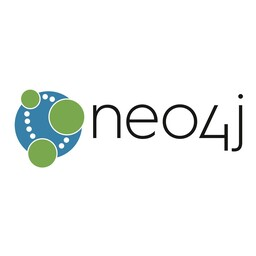

# Neo4J

In dem YouTube-Video wird Neo4J vorgestellt.

Neo4J ist eine in Java entwickelte NoSQL-Graph-Datenbank, die nicht nur Daten speichert, sondern auch die Beziehungen zwischen den Daten.

Die folgende Abbildung visualisiert einen solchen Graphen mit  entsprechenden sogenannten *Nodes* (Knoten) und *Relationships* (Kanten/Beziehungen):

Obwohl Neo4J zu den NoSQL-Datenbanken zählt, wird dennoch die Datenbankabfragesprache SQL (Structured Query Language) unterstützend vorangetreiben, da diese insbesonders bei Unternehmensanalytikern Anwednung findet.

Neo4J steht außerdem kurz vor dem Ziel, eine standardisierte Abfragesprache für alle Graph-Datenbanken, die sich Cypher nennt, zu etablieren.

Wer jedoch in der Cloud arbeiten möchte, hat die Möglichkeit, dies mit Neo4J, unter dem Namen "Aura", zu tun. [[16](https://www.bigdata-insider.de/graph-datenbanken-a-887332/)]

    https://neo4j.com/developer/get-started/

[Zurück zu Graph-Datenbanken](./Graphdatabase.md)
