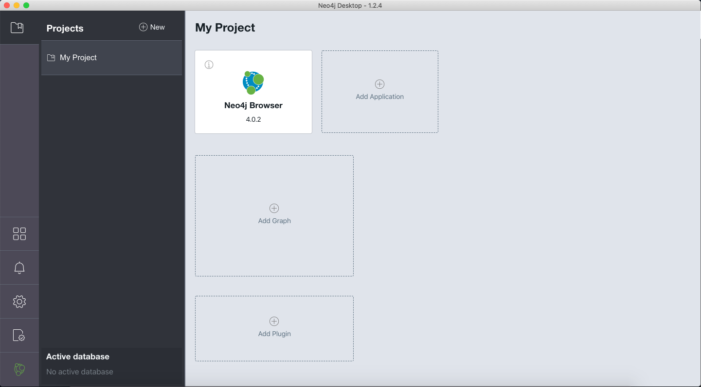
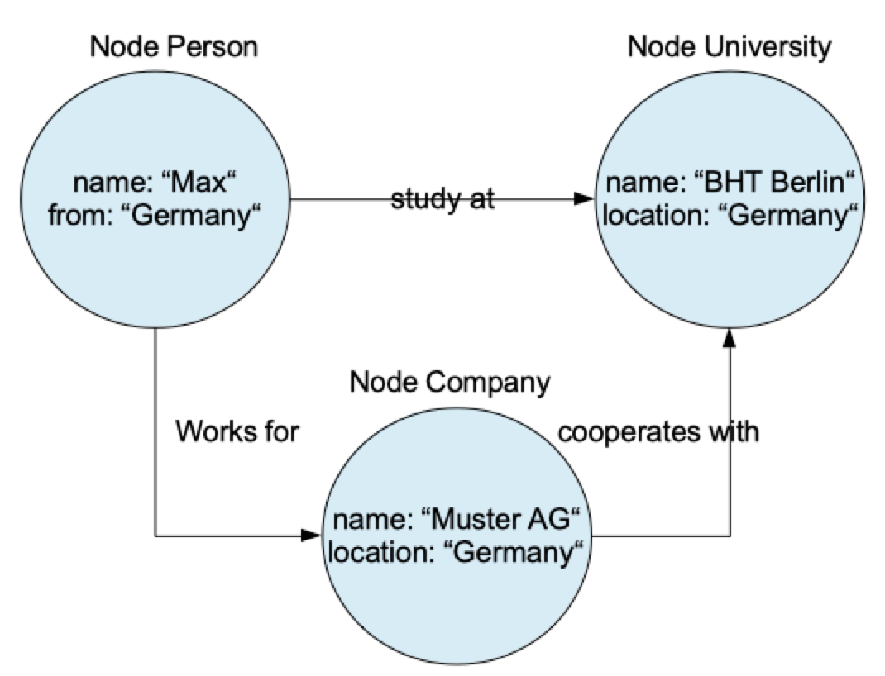
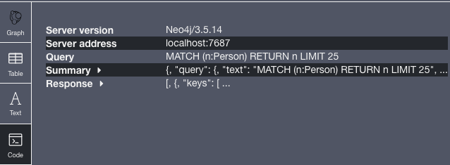
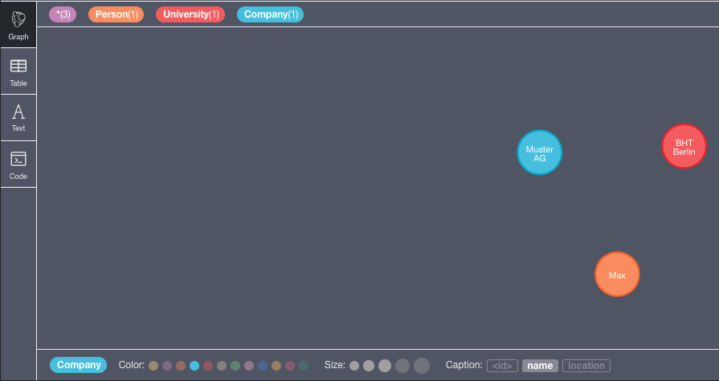
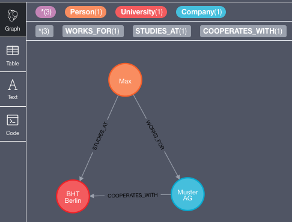

# Praxisbeispiel mit Neo4J Browser

Für das Praxisbeispiel wurde die entsprechende Dokumentation von Neo4J Browser herangezogen, die unter <https://neo4j.com/developer/neo4j-browser/> erreichbar ist.

Als Voraussetzung wird hier der Download von Neo4j Desktop genannt. Nach diesem, erwartet den Nutzer die folgende Startoberfläche:

Entsprechend der [Anleitung](https://neo4j.com/download-thanks-desktop/?edition=desktop&flavour=osx&release=1.2.4&offline=true) wurde ein neues Projekt angelegt und ein Graph erstellt.

Nach erfolgreichem Setup, ist die Datenbank unter <http://localhost:7474> erreichbar. Der einzige Unterschied zu Neo4j Desktop ist der Cloud Service, welcher in der folgenden Abbildung rot gekennzeichnet ist. Für das Praxisbeispiel wird an dieser Stelle jedoch Neo4j Desktop genutzt.

Zunächst soll an dieser Stelle ein ausgedachtes Modell vorgestellt werden, welches im Anschluss in die Datenabnk überführt wird.
Die Voraussetzungen für einen Graphen sind dabei Knoten, Beziehungen und Eigenschaften.

Um nun einen Datensatz anlegen zu können, wird die Datenbank gestartet und im Browser geöffnet. Es befindet sich in dem Fenster eine Art Suchspalt, in der die Cypher-Abfrage getippt wird. In der Abbildung ist zu sehen, wie ein erster Datensatz mit der Sprache Cypher erzeugt wurde.

Im Menü, welches ein- und ausgeblendet werden kann, sind Datenbankinformationen gelistet. Unter anderem ist hier auch der zuvor erstellte Node zu sehen.

Nach selektieren des Nodes "Person" wird in der Hauptansicht der Datensatz angezeigt. Dieser kann als grafischer Knoten, als Tabelle, als Text oder als Code dargestellt werden.

Analog erfolgt die Erstellung der Nodes *University* und *Company*. Über das Menü lassen sich auch alle drei Nodes (hier noch Beziehung zueinander) anzeigen.

Die Farben der Nodes können individuell verändert werden. Dazu ist lediglich ein Label zu selektieren und eine Farbe aus dem Menü, welches sich unter dem Fenster öffnet, zu wählen.

Nun fehlen nur noch die Beziehungen. Diese können über die entsprechenden Cypher-Abfragen hinzugefügt werden.

    MATCH (p:Person), (un:University) CREATE (p)-[r:STUDIES_AT]->(un)

    MATCH (co:Company), (un:University) CREATE (co)-[r:COOPERATES_WITH]->(un) RETURN(r)

    MATCH (p:Person), (co:Company) CREATE (p)-[r:WORKS_FOR]->(co)

Es ergibt sich nun folgender Graph:

Die Nodes lassen sich außerdem auch verschieben, indem der entsprechende Knoten selektiert und dann verschoben wird.

Es ist erkennbar, dass hier unendlich viele Knoten, Eigenschaften und Beziehungen erstellt werden können und Graph-Datenabnken ein Gewinn für das Zeitalter der Digitalisierung sind.

[Zurück zu Neo4J](./Neo4J.md)
