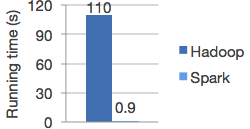

# 5.2.2 Vorteile

Spark selbst fasst die eigenen Vorteile zusammen als: „Speed“, „Ease of Use“, „Generality“ und „Runs Everywhere“ [[5.5](https://spark.apache.org/)]

Eine der stärksten Besonderheiten ist die In-Memory-Verarbeitung, wodurch Anwendungen spürbar beschleunigt werden. Spark selbst gibt eine über 100-fach schnellere Bearbeitung gegenüber Hadoop an. (vgl Abb XXX) Dies ist möglich, da Spark das MapReduce erweitert um u.a. interaktive Abfragen sowie die Verarbeitung von Datenströmen zu ermöglichen. Schnelligkeit ist bei der Verarbeitung großer Datenmengen enorm wichtig – hiervon hängt ab, ob man interaktiv in Echtzeit arbeiten kann oder je nach Komplexität Minuten beziehungsweise Stunden auf Ergebnisse warten muss.

Spark unterstützt unter anderem die in Data Science wichtigen Sprachen Java, Scala, Python, R, und SQL, kann aber auch  aus der Shell jeder dieser Programme verwendet werden.
In Spark lassen sich die für Data Science wichtigsten Lösungen nahtlos kombinieren: Spark SQL, Spark Streaming, MLlib / SparkML (Machine Learning), GraphX (Graph). Auf diese Bibliotheken werden wir im Kapitel XXX genauer eingehen.

Wo zu Beginn noch mehrere Systeme erforderlich waren, kann in Spark nun eine breite Palette von Aufgaben erledigt werden. Mit Spark wird es dadurch einfach und kostengünstig, verschiedene, in der Datenanalyse typische Verarbeitungstypen und -Schritte, zu kombinieren. Auch der Verwaltungsaufwand und die Kosten werden enorm reduziert. Sobald die Spark Engine optimiert wird, werden automatisch auch die Bibliotheken für SQL und Machine Learning schneller. Kosten für Wartung, Instandhaltung, Support, Tests und so weiter fallen - idealerweise - nur noch für ein einziges System, anstatt für mehrere Systeme, an.
Während andere Tools auch dafür eine Lösung anzubieten versuchen, wie die zu bearbeitenden Daten abgelegt sind, wählt Spark einen ganz anderen Weg: es wird akzeptiert, dass Daten bereits in einem Mix von Speichersystemen vorhanden sind und dass es teuer ist, daten zu bewegen. Anstatt sich also mit der Speicherung der Daten zu beschäftigen, liegt der Fokues auf deren Verarbeitung. Dies bietet zugleich den Vorteil, dass dank zahlreicher Schnittstellen Verbindungen mit vielen verschiedenen Datenquellen hergestellt werden können. Spark läuft nach Wunsch des Anwenders auf Hadoop, Apache Mesos, Kubernetes, als Standalone oder in der Cloud. Daten können aus Hadoop Distributed File System (HDFS), Alluxio, Apache Cassandra, Apache HBase, Apache Hive, und hunderter anderen Datenquellen bezogen werden.

All diese Faktoren haben dazu geführt, dass Spark zum “de facto”-Tool für jeden, an Datenanalyse / Big Data, interessierten Entwickler avanciert ist. Der Einstieg ist einfach und es kann problemlos zur Verarbeitung von enorm großen Mengen hochskaliert werden – unabhängig vom Ablageort der Daten.

 
*Abbildung 5.2: Logistic regression in Hadoopand Spark, [[5.6](https://spark.apache.org/)]*

 
*Abbildung 5.3: Arbeitsumgebung von Spark, [[5.7](https://spark.apache.org/)]*

[Zurück zu Entstehung](./5_2_1_Entstehung.md) || [Weiter zu Funktionsweise](./5_2_3_Funktionsweise.md)
