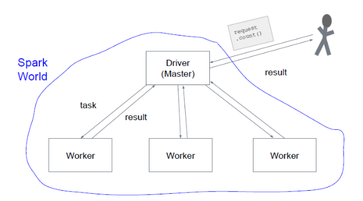

# 5.2.3 Funktionsweise

Von den in Spark zur Verfügung gestellten Datenstrukturen, wird der Resilient Distributed Dataset (RDD) ("robuster verteilter Datensatz") im Folgenden näher betrachtet.

Spark unterscheidet bei Operationen auf Datenstrukturen generell zwischen grundsätzlich voneinander unterschiedlichen Transformationen (map, filter, ...) und Aktionen (count, collect, take, save as text file). Mit einer Transformationen wird aus einem bereits vorhandenen RDD ein neuer RDD erzeugt. Aktionen hingegen dienen dazu, einen Wert aus einem RDD anzuzeigen, ohne dabei jedoch einen neuen RDD zu erzeugen. Während Transformationen per „lazy evaluation“ ausgeführt werden, werden Aktionen direkt berechnet. Aufgrund dieser “lazy evaluation” benötigen Transformationen so gut wie keine Zeit – Spark merkt sich lediglich, wie der RDD berechnet werden soll und speichert diese Schritte im „Directed Acyclic Graph“ (DAG) ab. Erst mit Ausführung einer Aktion wird der DAG abgearbeitet. Die Ausführung verteilt der Driver (Master) automatisch auf mehrere Worker (Slaves), während der Anwender jedoch weiterhin nur mit dem Driver (Master) interagiert.

 
*Abbildung 5.4: Funktionsweise: Anwender-Master-Worker, Patrick Baier*

Des Weiteren bietet Spark die Datenstruktur DataFrame (DF), die wir in ähnlicher Form bereits aus Python (pandas) kennen, an. Die jüngste Datenstruktur heißt DataSet (DS) – eine Kombination aus RDD und DF. Daten können als RDD angelegt und wie ein DF bearbeitet werden. Diese Datenstruktur gewinnt an Bedeutung und wird wohl auch in Zukunft noch wichtiger werden.

[Zurück zu Vorteile](./5_2_2_Vorteile.md) || [Weiter zu Architektur](./5_2_4_Architektur.md)
