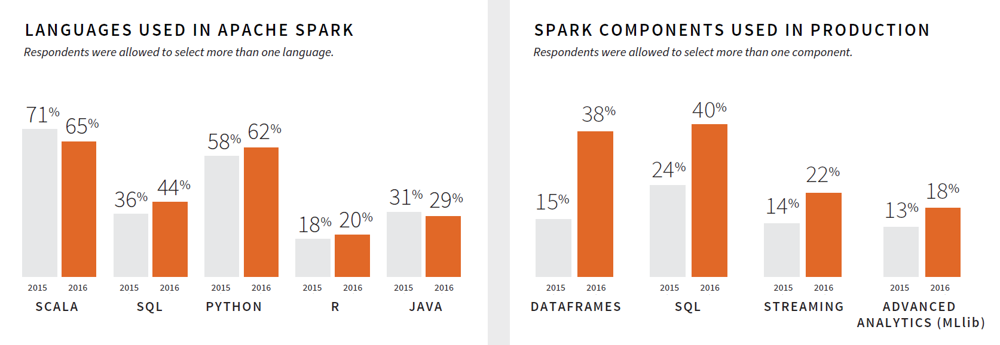

# Architektur

Als wichtigen Faktor für den Erfolg von Spark wurde die Vielzahl der an einer zentralen Stelle zur Verfügung gestellten Tools genannt. Dank dieser Architektur können mehrere, zuvor in unterschiedlichen Tools gelöste Aufgaben, nun in Spark, in einer einzigen Applikation, erledigt werden. Spark kann über Teams und Arbeitsschritte hinaus, auch zahlreiche Tools ersetzen, was dem Unternehmen unter anderem Wartungskosten spart. Diese Tools werden im Folgenden kurz vorgestellt.

Auch über diese Bibliotheken hinaus gibt es hunderte von Open Source Bibliotheken, die Lösungen zur Anbindung an bestimmte Speicherlösungen oder aber Algorithmen für Machine Learning, bieten.

Vorab sei erwähnt, dass die im Folgenden zu erklärenden Teile einen der größten Vorteile von Spark bilden: die Möglichkeit, unterschiedliche Prozesstypen nahtlos und eng beieinander liegend zu erledigen. Beispielsweise kann man Daten aus einem Datenstrom in Echtzeit auffangen und direkt per Machine Learning weiterverarbeiten. Gleichzeitig können Analysten SQL-Abfragen auf den resultierenden Daten ausführen. Data Scientists können über die Python shell auf dieselben Daten zugreifen und Ad Hoc Analysen durchführen. Und all das während das IT-Team nur ein einziges System zu warten hat.

Folgende Grafik zeigt die Ergebnisse einer Databricks-Umfrage aus dem Jahr XXX. Demnach nutzen XXX% der Befragten mindestens zwei und XXX% gleich drei der in Databricks zur Verfügung gestellten Programmiersprachen - ein starker Indikator, dass in der Verarbeitung von Big Data sehr häufig mehrere Programmiersprachen zum Einsatz kommen und gleichzeitig ein Indiz für die Beliebtheit von Spark.

 
*Abbildung 5.5: Aufbau von Apache Spark, Eigene Darstellung*

 
*Abbildung 5.6: Where Spark Shines, Eigene Darstellung*

## Spark Core

Im Kern ist Spark eine Rechenmaschine, die viele Rechenaufgaben über viele Worker zeitlich plant, verteilt und beobachtet. In diesem Kern liegt auch die API, die die RDDs definiert. Darüber hinaus liegen hier unter Anderem die Komponenten, die verantwortlich für die Planung, das Speichermanagement, die Fehlerbehandlung oder -behebung und Interaktion mit den Speichersystemen sind.

## SQL

Spark SQL ist dafür da, mit strukturierten Daten zu arbeiten. Daten lassen sich sowohl per SQL als auch dessen Derivat für Apache Hive HQL abfragen. Zudem unterstützt es viele weitere Datenquellen, wie etwa Hive Tabellen, Parquet, und JSON. Zusätzlich erlaubt Spark SQL es, SQL Abfragen mit den Manipulationen an RDDs in Python, Java, und Scala zu verknüpfen – alles innerhalb einer Applikation, wodurch SQL mit komplexer Analyse kombiniert wird.

## Streaming

Für die Verarbeitung von als (Live-)Stream ankommenden Daten, steht Spark Streaming zur Verfügung. Dies können zum Beispiel von Usern eines Webservice gepostete Statusaktualisierungen sein. Spark Streaming stellt eine API zur Verfügung, die der Bearbeitung von RDDs sehr ähnelt. Dadurch können Programmierer diese schneller lernen und einfacher zwischen Applikationen wechseln, die mit Daten aus dem Zwischenspeicher, von der Platte oder eben in Echtzeit ankommenden arbeiten.

## MLlib/SparkML

Mllib / SparkML ermöglicht Maschinelles Lernen in Spark. Verschiedene Algorithmen, wie classification, regression, clustering, und collaborative filtering, und so weiter stehen zur Verfügung.

## GraphX

Diese Bibliothek stellt Funktionalitäten zur Verfügung, um Graphen (zum Beispiel Netzwerk von Freunden auf Social Media) zu manipulieren. In Kapitel XXX) haben wir bereits Neo4J kennengelernt, das auch zur Verarbeitung von Graphendaten dient.

[Zurück zu XXX](./XXX.md) || [Weiter zu XXX](./XXX.md)
