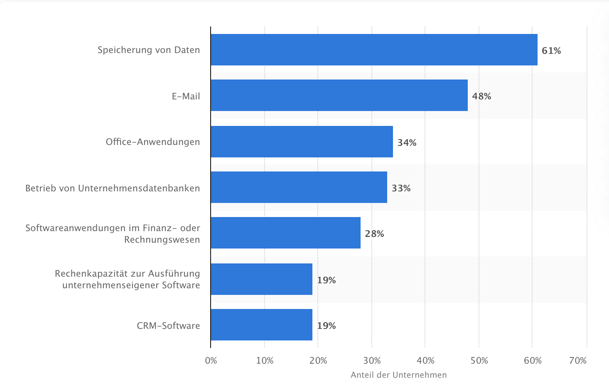
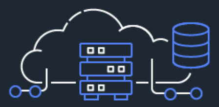
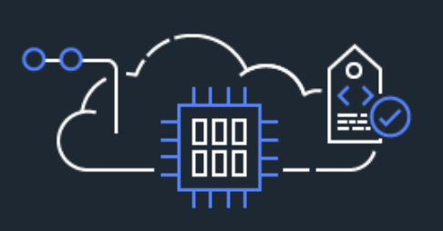
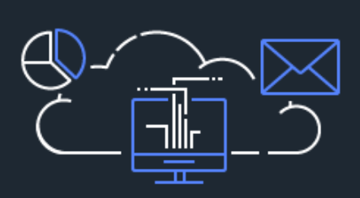

# 4.3 Cloud Computing

Data Analytics funktioniert ohne Cloud nicht mehr! Warum das so ist und welche Vorteile diese Kombination den Unternehmen so viel bringt, wird im Folgenden geklärt.

"Cloud Computing - in Verbindung mit Konnektivität und Bandbreite - ist das Rückgrat der Digitalisierung." [[8](https://www.t-systems.com/de/blickwinkel/house-of-clouds/data-analytics/big-data-cloud-566812)]

Die Vernetzung von Milliarden Geräten, Sensoren und anderen Komponenten steigt stetig weiter an und so werden auch weiterhin täglich Milliarden von Daten erfasst und versendet. Damit Unternehmen diese Daten gewinnbringend auswerten können, bedarf es an Speicherkapazitäten. Data Analytics sollten am besten in Echtzeit ausführbar sein und genau dafür kommt die Cloud zum Einsatz.

Die nachfolgende Abbildung zeigt den Anteil der Cloud-nutzenden Unternehmen in Deutschland, die kostenpflichtige Cloud-Dienste für folgende Zwecke im Jahr 2018 nutzen [[14](https://de.statista.com/statistik/daten/studie/381830/umfrage/einsatzzwecke-von-cloud-computing-in-unternehmen-in-deutschland/)]:

*Abbildung 4.3: Screenshot zu dem Anteil der Cloud-nutzenden Unternehmen in Deutschland, die kostenpflichtige Cloud-Dienste für folgende Zwecke im Jahr 2018 nutzen [[14](https://de.statista.com/statistik/daten/studie/381830/umfrage/einsatzzwecke-von-cloud-computing-in-unternehmen-in-deutschland/)]*

Als klarer Gewinner geht hier die Speicherung von Daten hervor - mit der Tendenz, in den nächsten Jahren stetig zu steigen.

Der Softwarehersteller *Tableau* nennt ein weiteres gewichtiges Argument für die Erfolgskombination Cloud und Big Data ein: "Die riesigen Mengen an strukturierten und unstrukturierten Daten, die durch das Internet der Dinge zustande kämen, würden immer häufiger von Cloud Services bereitgestellt."

Eine Cloud ist ein Zusammenspiel mehrerer unabhängiger Server, die unter Anderem die Datenspeicherung oder komplizierte Programmabläufe zur Aufgabe haben. Der Nutzer erfährt nicht, wie viele Server letztendlich hinter einer Cloud arbeiten und kann trotz eines Serverausfalls das gesamte System weiterhin nutzen.

"Die Cloud ist das große Ganze dieser Recheneinheiten." [[9](https://eigene-cloud-einrichten.de/was-ist-eine-cloud-cloud-computing-erklaert)]

Einer der bekanntesten und weltweit genutzten Cloud-Plattform sind Amazon Web Services (AWS). Bereits Millionen Kunden vertrauen auf die Cloud-Plattform, wenn es um Agilität, Elastizität, Kosteneinsparungen und um schnellere Realisierung von Innovationen geht.

Dabei wird zwischen drei Hauptarten des Cloud Computing unterschieden [[10](https://aws.amazon.com/de/what-is-cloud-computing/?nc1=f_cc), [11](https://www.cloudcomputing-insider.de/was-ist-infrastructure-as-a-service-a-605071/), [12](https://www.cloudcomputing-insider.de/was-ist-platform-as-a-service-a-624296/), [13](https://www.cloudcomputing-insider.de/was-ist-software-as-a-service-a-622859/)]:

Service | Beschreibung | Darstellung |
| :----: | :----: | :----: |
| Infrastructure as a Service (IaaS) | IaaS stellt dem Nutzer typische Komponenten einer Rechenzentruminfrastruktur wie Hardware, Rechenleistung, Speicherplatz oder Netzwerkressourcen aus der Cloud zur Verfügung. |  |
| Platform as a Service (PaaS) | Als PaaS wird eine Cloudumgebung verstanden, die eine Plattform für die Entwicklung von Anwendungen im Internet anbietet. PaaS baut auf IaaS auf und erweitert das Konzept der Bereitstellung von Hardware um weitere Features. |  |
| Software as a Service (SaaS) | SaaS ist ein Distributionsmodell für Anwendungen via Webbrowser und wird nur als Teilbereich in der Cloud verstanden. Die angeforderten Applikationen sind nie direkt auf dem Gerät des Nutzers vorhanden. |  |

*Abbildung 4.4: Screenshot zum Service IaaS [[10](https://aws.amazon.com/de/what-is-cloud-computing/?nc1=f_cc)]*
*Abbildung 4.5: Screenshot zum Service PaaS [[10](https://aws.amazon.com/de/what-is-cloud-computing/?nc1=f_cc)]*
*Abbildung 4.6: Screenshot zum Service SaaS [[10](https://aws.amazon.com/de/what-is-cloud-computing/?nc1=f_cc)]*

[Zurück zu API](./API.md) || [Weiter zu Blockchain](./Blockchain.md)
