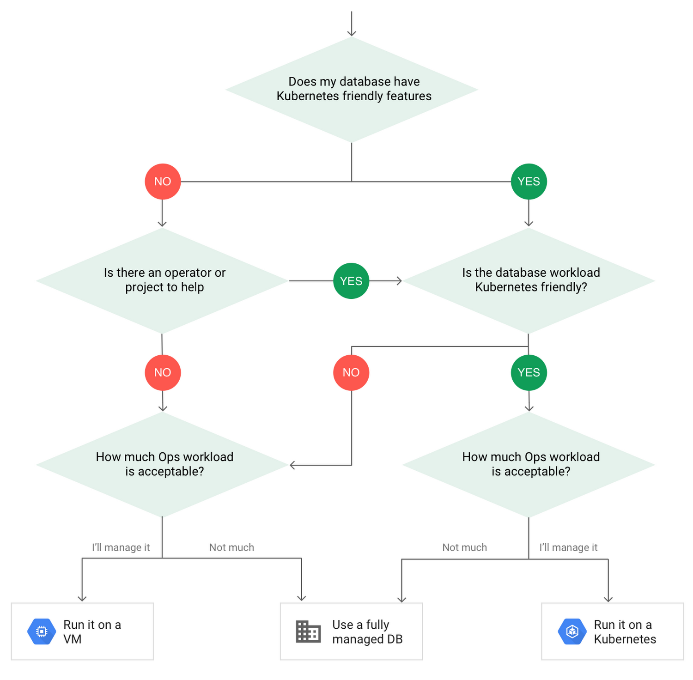

# When to Run Databases in Kubernetes

Kubernetes erweitert die Containertechnologie Docker und hilft klare Schwachstellen zu beheben sowie den Funktionsumfang und die Einsatzbereiche zu erweitern und vereinfachen. Ohne Kubernetes wäre z.B. eine Clusterbildung aus MongoDB-Nodes auf einer VM mit Docker schwieriger umzusetzen und würde große Defizite in der Verfügbarkeit aufweisen.

Durch Kubernetes kann wie in Abschnitt 4 beschrieben ein hochverfügbares Cluster aus Datenbanken aufgebaut werden, die alle für sich und gemeinsam einen konsistenten Datensatz aufweisen können. Spezielle datenbank-spezifische Operatoren helfen beim einfachen und schnellen Deployment, deren Betrieb sowie deren Skalierung.

Der Betrieb von Datenbanken ist also grundsätzlich möglich und beim Ausnutzen der richtigen Kubernetes-Funktionalitäten zuverlässig umzusetzen. Allerdings muss man auch anmerken, dass Kubernetes auf einem Cluster aus VMs oder Bare Metal aufsetzt und damit auf die darunterliegende Infrastruktur angewiesen ist. Es gibt also zwei Betrachtungsebenen, **die Infrastruktur und der in Kubernetes laufende Workload**.

Kubernetes ist in der Lage Workload von einem Hardware-Node bei dessen Ausfall auf andere zu verteilen, aber gegen den Ausfall von allen Nodes ist Kubernetes machtlos. Die in diesem Bericht beschriebene Verfügbarkeit bezieht sich also immer darauf, dass im absoluten Fehlerfall mindestens ein Node mit ausreichender Leistung zur Verfügung steht, um den gesamten Workload zu tragen. Das ist in den meisten Fällen, beim Einsatz von kleineren Clustern, nicht gegeben. Der Betrieb von Datenbanken und Kubernetes an sich macht also nur Sinn, wenn eine Vielzahl von Anwendungen auf einem geografisch verteilten größeren Netzwerk aus Hardware-Nodes betrieben werden. Nicht nur rentiert sich dann der manuelle Aufwand, sondern auch die Verfügbarkeit und Partitionstoleranz auf Systemebene ist erst dann gegeben.

Alternativ kann man die Hosted Kubernetes Lösungen wie z.B. Amazon EKS vom Cloud-Anbieter Amazon Web Services (AWS) verwenden, die ein hochverfügbares Kubernetes Cluster garantieren und Zusatzleistungen wie u.a. automatische Updates, Netzausgleiche und Lastverteilungen sowie Service-Erkennungen anbieten. [1]

> _"Amazon Elastic Kubernetes Service (EKS) ist ein verwalteter Service, mit dem Sie Kubernetes auf AWS einfach betreiben können, ohne eine eigene Kubernetes-Steuerebene installieren, betreiben und warten zu müssen."_ [...]
>
> _"Amazon EKS verwaltet automatisch die Verfügbarkeit und Skalierbarkeit der Knoten auf der Kubernetes-Steuerebene, die für das Starten und Stoppen der Container, das Planen von Containern auf virtuellen Rechnern, das Speichern von Cluster-Daten und andere Aufgaben verantwortlich sind. Amazon EKS erkennt automatisch nicht betriebsbereite Knoten auf der Steuerebene und ersetzt diese."_ [1]

Wenn man also hohe Ansprüche an die Verfügbarkeit und Partitionstoleranz einer Anwendung stellt und Kubernetes verwendet oder verwenden möchte, müssen diese Ansprüche auch auf die darunterliegende Infrastruktur übertragen werden. Der erfahrungsgemäß einfachste und stabilste Fall ist eine Hosted Kubernetes Lösung wie z.B. EKS von AWS oder Google's Kubernetes Engine.

## Alternativen zu Kubernetes

Kubernetes ist nicht die einzige Möglichkeit Datenbanken zu betreiben, denn selbst Kubernetes läuft meist auf partitionierten VMs. Laut Good, ein Google Solutions Architect, gibt es neben Kubernetes noch die Option des Betriebs auf einer VM und die Nutzung eines _fully managed Database_ Services. [2] Die für die meisten Applikationen wichtigste Anforderung der drei CAP-Theorem Kategorien ist die Hochverfügbarkeit. Alle Lösungen können dieser Anforderung gerecht werden, der Unterschied liegt nur im Aufwand.

**Virtuelle Maschine (VM):**

- Volle Kontrolle
- Hoher manueller Aufwand (Backups, Skalierung, Verfügbarkeit, Wartung, Sicherheit, Updating der VMs usw.)

**Kubernetes**

- Kubernetes Features und Vorteile wie Auto-Repair
- Manueller Aufwand (Ausfallsicherheit für Container, Backups der Daten usw.)

**Fully Managed Database**

- Einschränkungen in der Flexibilität (Version, Erweiterungen, Einstellungen usw.)
- Wenig bis kein Aufwand (Service übernimmt Wartung, Backups, Verfügbarkeit usw.)

Good empfiehlt folgenden Gedankengang für die Entscheidungsfindung zum Betrieb der Datenbank.

**_Entscheidungsweg: Wo betreibe ich meine Datenbank?_ [2]**

Zusammengefasst ist die Lösung bzw. der Einsatz der Fully Managed Database immer der sichere, aber evtl. nicht immer der performanteste und flexibelste. Eine VM sollte nur verwendet werden, wenn die zu betreibende Datenbank keinerlei Kubernetes bzw. Cloud Support liefert und bereits viel Erfahrung mit dem manuellen Betrieb von Datenbanken gesammelt wurde und keine Scheu vor hohem manuellem Aufwand besteht. Wenn allerdings schon viel Workload in Kubernetes Cluster betrieben wird und Datenbanken für die dort laufenden Anwendungen benötigt werden, diese Datenbanken auch einen guten Cloud-Support in Form eines Operators oder durch interne Funktionen bieten, spricht nichts gegen den Einsatz in Kubernetes. In diesen Fällen kann sogar ein performanteres Gesamtsystem geschaffen werden. Latenzen können durch den Betrieb von Datenbanken und Anwendung auf der gleichen VM/Kubernetes-Node reduziert werden anstatt mit einem irgendwo im Netz des Cloud-Anbieters betriebenden _fully managed_ Datenbankenservice kommuzieren zu müssen.

> _"When choosing to go down the Kubernetes route, think about what database you will be running, and how well it will work given the trade-offs previously discussed. Since pods are mortal, the likelihood of failover events is higher than a traditionally hosted or fully managed database. It will be easier to run a database on Kubernetes if it includes concepts like sharding, failover elections and replication built into its DNA (for example, ElasticSearch, Cassandra, or MongoDB). Some open source projects provide custom resources and operators to help with managing the database."_ [2]

Für die Entscheidung sind viele Faktoren sehr relevant und es gibt keine allgemeingültige Lösung. Je nach Anwendung sind bestimmte Aspekte aus dem CAP-Theorem wichtig oder für kleine Anwendungen auch keine. Manche Anwendungen stellen hohe Anforderungen an geringe Latenzzeiten oder einen geringen manuellen Aufwand im Setup und Betrieb.

Letztendlich ist die _"beste"_ Lösung immer individuell und abhängig von der zu betreibenden Anwendung samt Datenbank und den Möglichkeiten der darunterliegenden Infrastruktur. Allen voran ist die _"beste"_ Lösung aber auch abhängig von den Fähigkeiten und Präferenzen der Entwickler.

| #   | Literatur                                                                                                                                                                                                                                  |
| --- | ------------------------------------------------------------------------------------------------------------------------------------------------------------------------------------------------------------------------------------------ |
| [1] | _Amazon EKS – Funktionen_, https://aws.amazon.com/de/eks/features/, aufgerufen 13.12.2019                                                                                                                                                  |
| [2] | **Benjamin Good (3. Juli 2019)**: _To run or not to run a database on Kubernetes: What to consider_, https://cloud.google.com/blog/products/databases/to-run-or-not-to-run-a-database-on-kubernetes-what-to-consider, aufgerufen 1.11.2019 |

---

[<< Run Databases in Kubernetes ](4_dbInK8s.md) | [Inhaltsverzeichnis](0_inhalt.md)

---
