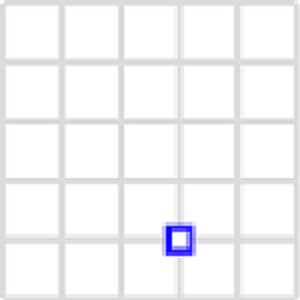
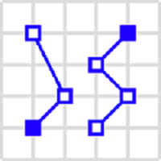
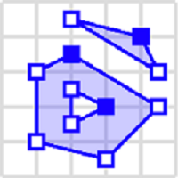

# Geometrische Formen

Neben den klassischen Datentypenen stellen Geodatenbanken spezielle Datentypen zum Speichern von Geoinformationen zur Verfügung. Dabei besitzen die Datentypen eine hierarische Vererbungsstruktur, ähnlich wie Objekte bei der Objektorientieren Programmierung. Diese Struktur erlaubt die Vererbung von Attributen und Verhalten von den ELternelementen an ihre Kindelemente. Im einfachsten Ansatz können diese Datentypen als Formen bezeichnet werden. Die folgende Abbildung enthält die Vererbungshierarchy der räumlichen Datentypen des Microsoft SQL Server 2019

 
[Quelle](https://docs.microsoft.com/de-de/sql/relational-databases/spatial/spatial-data-types-overview?view=sql-server-ver15)

Datentyp | Beispiel
------ | -----
**Punkt**  Der Punkt stellt einen einzelnen Ort im Referenzkoordinatensystem dar. Dieser setzt sich in der Regel aus einer X/Y-Koordinate zusammen. In den meißsten Fällen werden die X/Y-Koordinaten auch als Längen- und Breitengrad (Longitude/Latitude oder geografische Länge und Breite) bezeichnet. Die Werte für die Länge und Breite werden in Grad gemessen und haben fest vorgegebene Bereiche.  Die Werte für den Breitengrad liegen immer im Bereich (-90, 90). Werte für den Längengrad liegen immer im Bereich (-180, 180). Weitere Infromationen zu den Längen- und Breitengraden befindet sich im Abschnitt (TODO) | 
**Linestring** Ein LineString ist ein eindimensionales Objekt, das eine Sequenz aus Punkten und die sie verbindenden Liniensegmente darstellt.  | 
**Polygon**   | 
**Multipunkt**   | 
**Multilinestring**   | 
**Mulitpolygon** Test  | 

| [<< Einleitung](01_introduction.md) | Geometrische Formen | [Geometrische Funktionen >>](03_operations.md) |
|------------------------------------|------------|-------------------------------------|