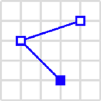
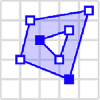

# Geometrische Operationen

Neben den in vorherigen Kapitel beschriebenen neu eingeführten geometrischen Datentypen verfügen Geodatenbank über spezielle geometrische funktionen, die das Arbeiten mit den neuen Datentypen erleichtern sollen.

Datentyp | Beispiel
------ | -----
**Punkt**  Der Punkt stellt einen einzelnen Ort dar. Dieser setzt sich in der Regel aus einem Längen- und Breitengrad (Latitude/Longitude) zusammen. Die Werte für die Breite und Länge werden in Grad gemessen und haben fest vorgegebene Bereiche.  Die Werte für den Breitengrad liegen immer im Bereich (-90, 90). Werte für den Längengrad liegen immer im Bereich [-180, 180]| 
**Linestring** Ein LineString ist ein eindimensionales Objekt, das eine Sequenz aus Punkten und die sie verbindenden Liniensegmente darstellt.  | 
**Polygon**   | 
**Multipunkt**   | 
**Multilinestring**   | 
**Mulitpolygon** Test  | 

| [<< Geometrische Formen](02_datatypes.md) | Geometrische Operationen | [Das Koordinatenreferenzsystem >>](04_coordinate_system.md) |
|------------------------------------|------------|-------------------------------------|

