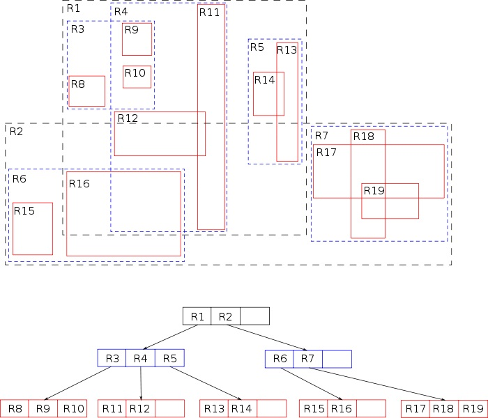

# Räumliche Indizes

 Ein räumlicher Index ist ein erweiterter Index, der es ermöglicht, eine räumliche Spalte zu indizieren. Eine räumliche Spalte ist eine Tabellenspalte mit Daten eines räumlichen Datentyps wie  
 Geometry oder dessen Kindselemente. Diese wurden in *Kapitel 2 Geometrische Datentypen* ausführlich beschrieben. Die Möglichkeit einen räumlichen Index zu erstellen ist eine der Grundanforderungen an eine Geodatenbank. Generell erlauben Indizes das performante Arbeiten mit großen Datenmengen.
 Ein regulärer Index arbeitet auf die Weise, dass die indexierten Einträge beim Schreiben des Werte hierarisch sortiert werden. Dies hat den Nachteil, dass Schreib und Löschoperationen in der Regel länger dauern als bei Daten ohne Index. Der Vorteil des Index zeigt sich bei lesenden Operationen wie das Suchen oder Ausgeben der indexierten Daten. Ein räumlicher Index arbeitet dabei etwas anders.  Anders als bei regulären Datenbankindizes werden die Einträge nicht in einer hierarischen Struktur gespeichert.

 Je nach Datenbanksystem werden unterschiedliche Techniken zur erstellung des räumlichen Indexes verwendet. Bei dem in der praktischen Übeung eingesetzten Datenbanksystem SpatiaLite wird die sogenannten *R-Baum Hierarchie* verwendet, die näher erläutert werden soll. Beim Microsoft SQL-Server werden hingegen sogenannten *B-Strukturen* verwendet[1]

## Die R-Baum Hierarchie

Bei der R-Baum Hierarchie werden die Koordinaten der urprünglichen Geometrie in eine sogenannte *BoundingBox* umgewandelt. Dabei ist eine BoundingBox nichts weiteres als ein Rechteck, dass sämtliche Punkte der Geometrie umschliesst[2]. Beim Speichern wird dieses Rechteck in der indexierten Spalte gespeichert.

||
|:--:|
|*Abbildung 5-1: Beispielhafte Entwicklung einer BoundingBox. Quelle [2]*|

Um nun zu prüfen, welche Geometrien in einer topologischen Relation stehen oder z.B. durch einen gewissen Punkte gehen wird geprüft, welche BoundingBoxen sich überschneiden oder welche BoundingBoxen den gesuchten Punkt enthalten. Dieser Suchvorgang ist wesentlich perfomanter als die Suche nach der exakten Geometrie. In späteren Suchdurchläufen wird die Suche verfeinert und der Baum wird in weitere Sub-Bäume unterteilt.

Man spricht von einem Baum, da größere BoundingBoxen kleinere BoundingBoxen umgeben. Ist die gesuchte Position bereits ausserhalb der ersten BoundinBox müssen die Kindselemente nicht weiter untersucht werden[3].

||
|:--:|
|*Abbildung 5-2: Hierarchische Darstellung eine R-Baume. Quelle: [3]*|

 Eine Erweiterung der *R-Baum Hierarchie* ist die _R*-Baum Hierarchie_ die versucht durch eine weiterentwickelte Split-Strategie das Überlappen von Rechtecksregionen zu minimieren.[4]

---

| [<< Referenzkoordinatensystem](04_coordinate_system.md) | Räumliche Indizes | [Praktische Anwendung >>](06_exercise.md) |
|------------------------------------|------------|-------------------------------------|

---

| #   | Literatur            |
| --- |--------------------------------------------------------------------------------------------------------------------------------------------------------------------------------------------------|
| [1] | **Micrososft**: *Übersicht über räumliche Indizes*, [https://docs.microsoft.com/de-de/sql/relational-databases/spatial/spatial-indexes-overview?view=sql-server-ver15](https://docs.microsoft.com/de-de/sql/relational-databases/spatial/spatial-indexes-overview?view=sql-server-ver15), abgerufen am 08.01.2020  |
| [2] | **PostGIS**: *Spatial Indexing*, [https://postgis.net/workshops/postgis-intro/indexing.html](https://postgis.net/workshops/postgis-intro/indexing.html), abgerufen am 26.01.2020  |
| [3] | **SpatiaLite**: *Wonderful R*Tree Spatial Index*, [https://www.gaia-gis.it/spatialite-3.0.0-BETA/spatialite-cookbook/html/rtree.html](https://www.gaia-gis.it/spatialite-3.0.0-BETA/spatialite-cookbook/html/rtree.html), abgerufen am 26.01.2020  |
| [4] | **Wikipedia**: *R-Baum*, [https://de.wikipedia.org/wiki/R-Baum](https://de.wikipedia.org/wiki/R-Baum), abgerufen am 26.01.2020  |
