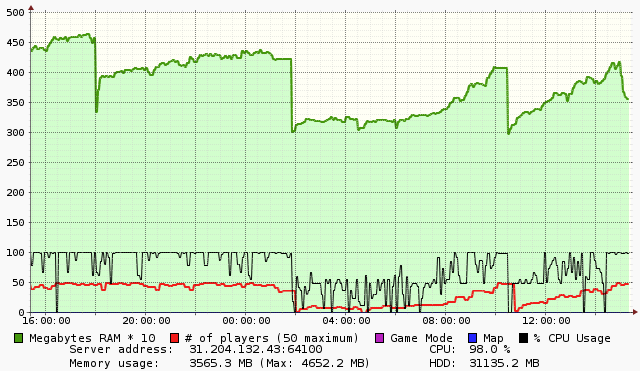
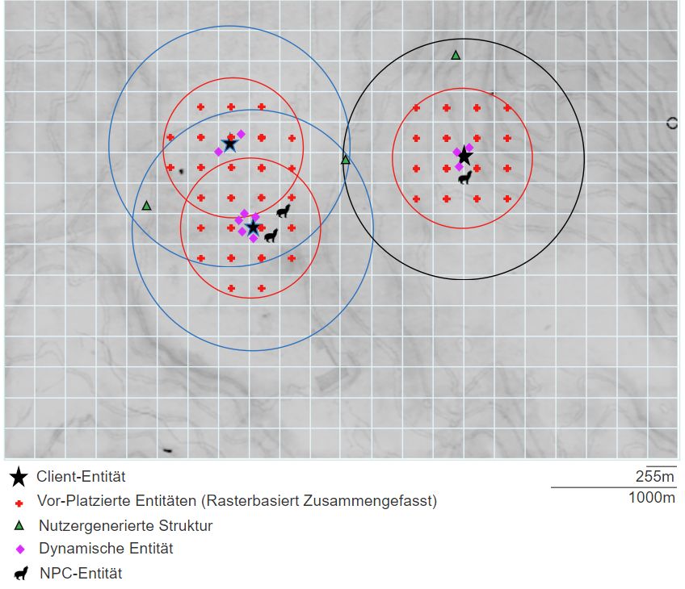
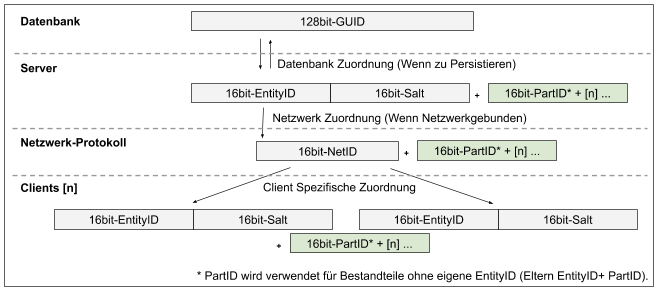

[<< Herausforderungen](05_herausforderungen.md) | [Inhaltsverzeichnis](02_toc.md) | [Zusammenfassung >>](07_zusammenfassung.md)
|-|-|-|
---

# 4. Fallbeispiel - Optimierung der Replikation für Echtzeit Simulationen (mit Hilfe von Aspekten, Graphen, Räumlicher-Partitionierung und weiteren Techniken)

Als Fallbeispiele sollen die Replikation und das Persistieren von Echtzeit-Simulationen in Computerspielen unter Einsatz von diversen Technologien dienen. Hierbei werden virtuelle, bewegliche Entitäten mit individuellen Zuständen in mehreren Schachtelungstiefen ineinander und mit Abhängigkeiten zueinander gespeichert. Zusätzlich werden stationäre, nutzergenerierte Strukturen auch direkt in der Welt platziert. Zudem bestehen auch Kombinationen aus beweglichen Entitäten mit relativ zu Ihnen gespeicherten nutzergenerierte Strukturen.

Entitäten enthalten neben Ihrer räumlichen Lage eine Vielzahl an Zuständen, welche in Aspekte separiert werden können. Die Abhängigkeiten und Schachtelungen dieser Entitäten und Strukturen miteinander wird über Eltern-Kind Relationen als Graph abgebildet. 

Für diesen Anwendungsfall ist vor allem das Server-Client-Replikationsprotokoll eine Herausforderung, während die Datenbank-Persistierung ein eher geringes Problem ist. Dies verhält sich so, da die meisten Transaktionen direkt im Speicher des Servers vorgenommen werden und nur Langzeit-Informationen und wichtige Transaktionen an die Datenbank weitergeleitet werden. Desweiteren lassen sich die Langzeit-Daten sehr gut über regionale oder räumliche Partitionierungen verteilen. Als kritische Operationen für die Echtzeit-Kommunikation zwischen Server und Datenbank ist Folgendes zu sehen:
* Hochfahren des Servers (Replikation aller stationären und beweglichen In-Welt Entitäten)
* Initial Synchronisierung, Authentifizierung und Verbindung eines neuen Clients (Replikation aller Client abhängigen Entitäten)
* Autoritäts Wechsel von Entitäten also atomare Transaktionen wie der Austausch von Entitäten zwischen Clients oder Server-Regions-Partitionen (Verlust oder Duplikat Vermeidung)

Hierbei ist es wichtig die Replizierung zwischen Langzeit-Speicherungs Datenbanktechnologie, In-Speicher Echtzeit-Server für den aktuellen Weltzustand, sowie den vielen verschiedenen Clients, effizient zu gestalten. Die Leistung und Bandbreite der Echtzeit-Server werden, durch die vielen Clients und die sich kontinuierlich ändernden Entitätszustände, an die Grenzen Ihrer Leistungsfähigkeit gebracht.

Die Hauptanforderung für einen Echtzeitbetrieb ist eine niedrige möglichst isochrone Zykluszeit. Dies ist wichtig, um den Clients eine flüssig wirkende Interaktion und akkurate physikalische Simulation zu bieten, dies lässt sich wiederum nur erreichen durch effiziente deterministische Algorithmen und Datenstrukturen.

Da die Zykluszeit des Servers sich nicht synchron zu den Clients verhält, werden zusätzlich auf jedem Client Inter- und Extrapolationen der physikalischen Simulation durchgeführt. Interpolation werden eingesetzt für sekundäre nicht wichtige Entitäten, um den Schein einer flüssigen Simulation zu wahren. Extrapolationen werden eingesetzt, um für wichtige Entitäten Vorhersagen zu treffen (z.B. Aufschwingen einer Tür). Weichen clientseitige Extrapolation zu stark von der Server Simulation ab, werden sie auf den Serverzustand zurückgesetzt.

Hierzu muss der Begriff der Autorität eingeführt werden. Sie bedeutet das für Teilaspekte von Entitäten ein Client die Priorität bekommt. Der Server muss den Zustand dieser Teilaspekte des Clients mit Autorität an die anderen Clients weiterleiten. Dies ist nötig, wenn Näherungsverfahren nicht funktionieren, also zum Beispiel: Wenn ein Client sich mit einer Fahrzeug Entität mit hoher Geschwindigkeit durch die Simulation bewegt und Hindernissen mit niedriger Reaktionszeit ausweichen muss.

Es sind 6 verschiedene Replikationsstrategien zu nennen, welche je nach Anforderungen Einsatz finden:
1. Replikation des gesamten Zustands zu allen Clients (für kleine Welten mit wenigen Entitäten)
2. Replikation eines durch Abhängigkeiten und Aspekte reduzierten gesamten Zustandes zu allen Clients (für mittlere Vorhaben)
3. Replikation mit Relevanz Prüfungen wie Relationsgraphen, räumliche Entfernung und Sichtbarkeit (für große Welten mit mittlerer Anzahl Entitäten)
4. Replikation über räumliche Partitionierung in Kombination mit Eigenschaften aus 3. (für riesige Welten mit sehr vielen Entitäten)
5. Verzicht auf Replikation stattdessen Terminalserver artige Übertragung von Nah-Echtzeit komprimierten Video-Streams und IO-Ereignissen. (Für riesigen Welten mit sehr vielen Entitäten oder bei Verzicht auf leistungsstarke Client-Hardware)
6. Teil-Replikation mit nicht Echtzeitdaten (für asynchrone Welten, unabhängig von Entitäten Anzahl)

Die 3. der Techniken soll im Detail betrachtet werden für dieses Fallbeispiel, die anderen dienen der Vorbereitung und als Ausblick auf Zukunft und alternative Ansätze. Als Quelle für die Beobachtungen und Erkenntnisse zu der technischen Optimierung und den Verhaltensweisen dient die eigene Tätigkeit 2013-2020 im Bereich.

## 4.1 Gesamtreplikation über Broadcast
Die beiden ersten Techniken waren Stand der Technik bis vor etwa 10 Jahren, sie werden aber für kleinere Vorhaben immer noch eingesetzt aufgrund ihrer Einfachheit, der zusätzliche Effizienz und niedrigeren Zykluszeiten. Es wird auf Relevanz Prüfungen verzichtet und das Design so gewählt, dass die Client- und Entitäten Anzahl nicht aus dem Rahmen fallen. Dadurch das für alle Clients alles relevant ist können Übertragungspuffer für die Multicast-Übertragung großteils ohne Individualisierungen wiederverwendet werden, was Speicher Einsparungen bedeutet.

Die Puffer Wiederverwendung machen den Einsatz von Kompressionstechniken sinnvoll, die bei stark Individualisierten Übertragungspuffern nicht effizient wären. Die Kompression des Datenstroms ermöglicht nach Performance und Speicher Profiling Tests auch wieder eine Erhöhung der Client- und Entitäten-Anzahl.

Neben der erhöhten Bandbreiten Nutzung hat die Technik den Nachteil das die Clients zu viele oder gar alle Informationen empfangen. Was für Computerspiele bedeutet das Betrugssoftware clientseitig auch auf diese Informationen zugreifen kann.

## 4.2 Replikation über einfachen Multicast
Die zweite Technik führt Individualisierung der Puffer ein, verzichtet jedoch noch auf aufwendigere Relevanzprüfungen. Es wird davon ausgegangen, dass die meisten Entitäten zueinander immer relevant sind. Diese Technik wird stark bei kurzweiligen rundenbasierten Simulationen mit kleiner Entitäten Anzahl eingesetzt, in diesem Szenario ist die Simulationswelt eingeschränkt teils mit schlauchartigen Designs und zu klein, um eine Optimierung nach räumlichen Kriterien sinnvoll zu machen.

Es wird nach der initialen Synchronisierung des Simulation-Zustandes vermieden identisch gebliebene Informationen nochmals zu übertragen. Bei Zustandsänderungen einer Entität werden also nicht alle Aspekte einer Entität erneut übertragen, sondern nur die Aspekte, die sich geändert haben. Dadurch ist es bei diesem Einsatz bei vielen Implementierungen nicht möglich, nachträglich sich mit der Simulation zu synchronisieren und muss auf die nächste Runde warten. Implementierungen, welche das nachträgliche Synchronisieren unterstützen sammeln in diesem Falle alle Zustands Aspekte aller Entitäten und pausiert ggf. auch den Simulationsablauf bis die neuen Clients voll synchronisiert sind.

Um Client-basierten Betrug zu vermeiden, nicht wegen hoher Datenmengen, ist im letzten Jahrzehnt dazu übergegangen zusätzlich Relevanz Eingrenzung vorzunehmen. Hierbei hat sich die Bestimmung von Sichtbarkeit Informationen anhand von BSP-Bäumen oder für Top-Down Simulationen auch die Prüfung einfacher rasterbasierte Sicht Bitmasken bewährt.

## 4.3 Replikation über komplexen Multicast (virtueller Geocast)
Auf Basis dieser Grundlage entstand dann auch die 3. Technik, welche die Relevanzprüfung hauptsächlich aus Gründen der Datenmengen und CPU-Zeit Reduzierung vornimmt. Anders als bei den vorherig genannten Techniken ist die Datenmenge für diese Langzeit Simulationen (bis zu einem realen Tag) mit Größen von etwa 4 km²-~10 km² nicht mehr bewältigbar für einen Server, welcher maximal 65k dynamische Entitäten unterstützt. Je nach Simulationsart ist zu planen für 250 statischen Entitäten je 255 m² sowie weiteren 250 Dynamischen zu Spitzenzeiten, das ergibt durchschnittlich 2 pro 1 m² und somit bei einer 8 km² Simulation bereits bis zu 64 Millionen Entitäten.

Wenn die CPU des Servers, durch hohe Clientanzahl, 100 % Auslastung (wie im obigen Diagramm) erreicht entstehen erhöhte Latenzzeiten, was durch Optimierungen vermieden werden sollte. Der Server muss über Relevanzkriterien entscheiden, welche dieser Entitäten in den begrenzten Speicher und ID-Adressraum geladen werden und welche in Datenbank verbleiben und dynamisch bei Bedarf nachgeladen oder aufgeräumt und neu generiert werden. Die Server Relevanzbewertung erfolgt anhand von der räumlichen Lage aller Client Entitäten, der Auslastung von Simulationssektoren und der vergangenen Zeit seit letzter Client Interaktion zu Entitäten. Es wird ausgenutzt, dass Sektoren, welche von keinem Client gesehen werden, auch bis auf vereinzelte Ausnahmen nicht weiter simuliert werden müssen und somit persistiert bzw. verworfen werden können.

Zusätzlich wird serverseitig je Client bestimmt, welche Entitäten relevant ist, hierbei werden über Entität Wichtigkeit, Größe und Entfernung sowie Abhängigkeitsgraphen Selektionen vorgenommen. Für das Fallbeispiel sind Relevanz Entfernungen folgend gewählt: etwa 800 m für nutzergenerierte Strukturen, 750 m für Client- und Fahrzeug-Entitäten, 300 m für NPC-Entitäten und Lichtquellen sowie ~25-100 m für die restlichen Entitäten wie Gegenstände.

In der Simulation vor-platzierte Entitäten (wie z. B. Türen, Lichter) werden gruppiert als Entität in einem 250 m Raster. Der gleiche Mechanismus wird auch für nutzergenerierte Strukturen genutzt. Weitere Raster werden eingesetzt, um temporäre Interaktionsmöglichkeiten zu generieren welche vom Client genutzt werden können, um serverseitig Entitäten zu erzeugen. Dies wird im Raster serverseitig vermerkt, sodass die Anfrage nicht beliebig wiederholt werden kann.

Im obigen Diagramm ist die Relevanz von zwei blauen Client-Entitäten zueinander dargestellt, eine weitere Client-Entität ist nicht relevant zu ihnen. Die nutzergenerierte Struktur in der Mitte der Client-Entitäten ist relevant zu allen drei Clients. Wenn das Zentrum, einer Rasterzelle, im Relevanzradius ist, so werden alle Bestandteile dieser Zusammenfassung dem jeweiligen Client relevant. Die anderen Entitäten und der Leerraum illustrieren, dass je nach räumlicher Clientverteilung auch nicht alle Entitäten immer im Speicher vorhanden sein müssen, sondern es auch reicht diese bei Bedarf nachzuladen oder zu generieren.

Um nicht für jeden Server Simulationsschritt für jede Entität die Lage mit allen Client-Entität-Lagen zu vergleichen werden die Prüfungen gestaffelt in zeitlichen Abständen von 1-6 Sekunden und einer Zufallskomponente durchgeführt. Zusätzlich werden Octrees für die räumliche Vor-Selektion der dynamischen Entitäten und Entitäten mit polygonal geformten Effekt Bereichen eingesetzt. Abhängigkeitsgraphen selektieren zusätzliche Entitäten, die über eine Eigentums bzw. Bestandteil Relation relevant sind.

Da der Server nicht alle Relevanz Änderungen auf einmal verarbeiten kann, erfolgt die Übertragung inkrementell anhand einer Relevanz FIFO-Warteliste (sofern Relevanz noch besteht zum Übertragungszeitpunkt). Nicht mehr relevante Entitäten werden, nach Erreichen einer Schwelle von zusätzlichen 20 % zur Relevanz Entfernung, nach Persistierung aufgeräumt (Server und clientseitig). Dies erfolgt da der 16-Bit In-Speicher ID-Adressraum des Servers und Netzwerkprotokolls aus Kapazitäts- und Effizienzgründen maximal 65k dynamische Entitäten unterstützt.

Die nachträgliche Synchronisierung von Clients auf den laufenden Langzeit-Simulationszustand ist von Grund auf vorgesehen. Die Relevanzkriterien entscheiden welche Entitäten zum neuen Client synchronisiert werden müssen, der Simulationszustand muss nicht pausiert werden.

Ein Spezialfall ist das Streaming von Echtzeit Sprachdaten, diese haben eigene Relevanzkriterien wie die Hörschwelle durch Dämpfung abhängig von Flüstern, Sprechen und Verstärkern sowie der Frequenz bei Nutzung eines virtuellem Funkgerätes. Um für diese Daten einen hohen QoS zu erreichen wird zusätzlich ein Übertragungskanal für VoIP zwischen Client und Server aufgebaut. Für jeden Client wird hierbei ein Sprachbuffer mit allen aktuellen relevanten Sprachquellen befüllt, encodiert und wieder zurückgesendet. Eine nachträgliche Replikation oder das Persistieren der Sprachdaten erfolgt nicht.

Es wird für die Datenbank Persistierung serverseitig mit 128-Bit GUIDs gearbeitet welche genug Entropie bieten, um auch mehrere Server im Datenbank Verbund zu betreiben. Sie werden auch genutzt, um Langzeit Relationen als Graphen zwischen Entitäten und Strukturen zu speichern, es handelt sich hierbei z. B. um Eigentum, Bestandteil und Verbund Relationen. Diese Graphen werden für Strukturen auch direkt zur physikalischen Stabilität Bewertung herangezogen, um z. B. einen in der Luft schwebenden nutzergenerierten Strukturverbund zu erkennen und zu korrigieren.

Ein Datenbankverbund mehrere Server hat den Vorteil, dass Informationen direkt zwischen mehreren Servern geteilt werden können und ein Umzug oder Tausch der Server-Hardware vereinfacht wird. Als Nachteil eines Datenbankverbundes ist die erhöhte Latenzzeit, längere Server-Initiierung Zeiten, größeres Ausfallrisiko und erhöhte Komplexität zu nennen. Im Fallbeispiel existieren beide Varianten mit den genannten Vor- und Nachteilen. Datenbankänderungen werden in minütlich Intervallen über Transaktionen im Batchbetrieb ausgelöst, um die langsamen IO-Operationen möglichst effizient zu gestalten.

Der Server selbst verwendet einen 32-Bit-Server-Entitäts-ID-Adressraum (16-Bit + 16-Bit Wiederverwendungs Salt). Wenn dieser Adressraum durch Relevanz Änderungen erschöpft ist, muss der Server neustarten, um ID-Kollisionen im Netzwerkprotokoll zu verhindern. Die Server-Entität-IDs werden für das Netzwerkprotokoll je Client individuell auf eine 16-Bit-Netzwerk-ID gemappt. Die Clients arbeiten, wie der Server und bilden die Entitäten wieder in einem individuellem 32-Bit-ID-Adressraum mit zusätzlicher Entropie aus Salt ab. Zusätzlich unterstützt jede der Entitäten bis zu 250 Unter Entitäten für Strukturelemente, welche nicht im Server und Client ID-Adressraum auftauchen. Sie nutzen einen individuellen Adressraum innerhalb der Entität selbst, sie besitzen auch eine GUID welche jedoch nur der Server zur Langzeit Persistierung kennt.

Die Simulation nutzt aus Effizienzgründen Gleitkommazahlen einfacher Genauigkeit in Form eines Quaternion samt Translation, um die Lage der Entitäten abzubilden. Dies ist problematisch bei dieser Simulation Größe und führt zu sichtbaren Ungenauigkeiten. Mit steigender Entfernung zum Simulationszentrum sinkt die Präzision der Entität-Lagen, dies führt dazu das am Simulationsrand schon ab einer Entfernung von 4 km für Clients bei Bewegungen durch Nutzung von Bildvergrößerung ein Zittern der Entität-Lagen sichtbar wird. Hier empfiehlt sich der Wechsel auf Gleitkommazahlen doppelter Genauigkeit, welche jedoch aus Effizienzgründen nicht möglich ist, da der Server bereits an seiner Leistungsgrenze für das Fallbeispiel ist.

## 4.4 Replikation über Partitionierungs Zwischenschicht
Soll die Simulation trotz dieser Hindernisse noch größer werden muss also eine Lösung eingesetzt werden, welche die Simulation über mehrere Server skaliert. Hier setzt die 4. genannte Technik ein, die Simulation wird in für die technischen Einschränkungen passende Sektoren partitioniert. Es muss eine Zwischenschicht vorgesehen werden, welche zwischen Client und Server vermittelt, um zu entscheiden wann welche Entitäten bei Serversektor Wechsel relevant werden. Diese Zwischenschicht, entscheidet zur Laufzeit, aus Auslastungsgründen Sektoren weiter zu teilen oder wieder zusammenzuführen und somit neue Server-Instanzen zu starten oder einzusparen (z. B. anhand der Verteilung der Client-Entitäten).

Ein Nachteil dieser Technik sind die im Vergleich zu den bisher genannten Technologien, um Faktor 5-8x höhere laufende Kosten um die gleiche Clientanzahl und Simulationsgröße wie bei der unter 3. genannten Technologie zu realisieren. Dies hat zur Folge das für den Betrieb mit Clients ein Festpreis-Modell mit größerem finanziellen Risiko verbunden ist und eigentlich nur ein Abo-Modell infrage kommt. Der Vorteil ist die hohe Skalierbarkeit und das in der Technik verankerte Loadbalancing. Dies ermöglicht Simulationsgrößen von über 10 km mit über 1000 Client-Entitäten, was nicht mit den bisher genannten Techniken möglich war. Ein Beispiel für solch eine Middleware ist [SpatialOS](https://improbable.io/spatialos).

## 4.5 Verzicht auf Replikation über Einsatz von Streaming
Die 5. der Techniken, der Ersatz von Replikation mit Videostreaming, ist erst in den letzten Jahren im Einsatz. Erst jetzt reichen Client-Bandbreite und geringe algorithmische Laufzeit der Videocodecs um dieses Szenario ermöglichen. Auch ist inzwischen der Hardware Support für de- und Encoding in Consumer - Hardware weit verbreitet. Ein bestehender Nachteil ist die Netzwerklatenz, welche zu Eingabeverzögerung führt.

Es werden Stand 2019 noch nicht die vollen Vorteile der Technik ausgeschöpft. Die Cloud-Server-Hardware, die das Rendering der Simulation vornimmt, wird als Dienst kurzzeitig für Einzelspieler oder normale Mehrspieler Simulation als Client-Hardware Ersatz vermietet. Weiterer Nachteil sind die hohen Kosten auf Rechenzentrum Seite, welche nur sinnvoll sind, wenn die Client-Hardware entsprechend leistungsschwach und günstig ist und somit ein Abo-Modell ermöglicht.

Der sinnvollere Einsatz dieser Technologie ist der Verzicht auf die serverseitige Replikation des Umfangreichen und komplexen Simulation-Zustands, dieser bleibt im Cloud-Rechenzentrum. Das hat den Vorteil das alle Clients unabhängig von Ihrer Hardware und Standort mit nahezu identischen Bedingungen die gleiche Simulation nutzen können. Manipulation und Betrugssoftware hat reduzierte Chancen da aus einem Video-Stream nicht Zusatzinformationen extrahiert werden können.

## 4.6 Verzicht auf Replikation über Aktzeptanz des asynchronen Zustands
Als letzte Technik ist zu nennen der Verzicht auf die Synchronität des Simulationzustandes zwischen Clients und Server, es handelt sich also um eigenständige Client-Simulationen, welche durch serverseitige Daten augmentiert werden. Clients senden Informationen zu einem Server dieser persistiert diese und entscheidet dann, welche davon er anderen Clients als Informationsmehrwert zur Verfügung stellt.

Dies hat den Vorteil, dass serverseitig nur geringe Betriebskosten entstehen und trotzdem Telemetriedaten gesammelt werden können. Je nach Design der augmentierten clientseitigen Simulationen helfen die Zusatzdaten den Clients oder beeinflussen die clientseitige Simulation in Teilaspekten. Der Nachteil ist, dass Clients nur indirekt miteinander interagieren können.

---

[<< Herausforderungen](05_herausforderungen.md) | [Inhaltsverzeichnis](02_toc.md) | [Zusammenfassung >>](07_zusammenfassung.md)
|-|-|-|
