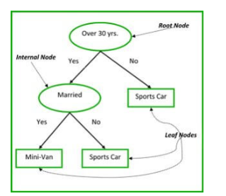

# Algorithmen des überwachten Lernens

## Lineare Regression

Die Einschätzung eines gewissen Wertes, beispielsweise Umsatzvorhersagen oder das Einschätzen einer Besucherzahl, kann durch Annäherung unter Verwendung linearer Regression durchgeführt werden. Dabei wird mittels eines oder mehrer veränderbaren Parameter eine Funktion der Form ax+b bestimmt, die den Mittelwert der Wahrscheinlichkeiten abbildet. Unterschieden wird dabei zwischen einfacher und multipler linearer Regression, abhängig von der Verwendung eines oder mehrerer variabler Faktoren. [41] [42]

## Logistische Regression

Durch die logistische Regression wird die Wahrscheinlichkeit, ob ein bestimmtes Ereignis eintritt oder nicht, vorher bestimmt. Einsatzbereiche können beispielsweise die Berechnung der Wahrscheinlichkeit, ob eine Person eine Fernsehsendung gesehen hat, Krankheitsbilder oder die Bekanntheit einer Marke sein. Der variable Faktor ist bei der logistischen Regression ein binärer Faktor, der die Werte 0 und 1 annehmen kann, bzw. abbildet, ob ein Ergebnis eingetreten ist oder nicht.

Durch die Verwendung der logistischen Regression (auch LOGIT) kann eine prozentuale Wahrscheinlichkeit berechnet werden, beispielsweise, dass ein Kunde mit einer Wahrscheinlichkeit von 95% ein Produkt erwirbt. Die logistische Regression unterscheidet sich gegenüber der linearen Regression durch das Verwenden des Binärfaktors, bei der linearen Regression kann der variable Faktor mehr als zwei Werte annehmen. [43]

## Classification and Regression Trees

Der CART- Algorithmus basiert auf Entscheidungsbäumen, ein Ergebnis ist dabei die Kette ein oder mehrer binärer Ereignisse. Das Verfahren eignet sich beispielsweise hervorragend zum Auffinden von Fehlern oder zum Data Mining. Ein ähnliches Verfahren, bei dem ebenfalls Entscheidungsbäume als Grundlage für die Berechnung der Wahrscheinlichkeit verwendet werden, ist der Interactive Dichotomizer Algorithmus. 

Der Entscheidungsbaum dient als Grundlage zur Berechnung des möglichen Ausgangs eines Ereignisses - dieses kann sich in seiner Aussage aber durch stetige Eigenschaften (z.B. die Fiebertemperatur in Grad) oder der Zuordnung zu einer gewissen Klasse (der Patient hat überlebt oder nicht) unterscheiden. Stetige Eigenschaften durch Regression, die Zuordnung zu einer gewissen Klasse durch Klassifikation berechnet. [44]

## Naiive Bayes

Durch die Methode von Bayes wird, basierend auf dem Bayeschen Theorem, durch von einander unabhängige Variablen der Ausgang eines Ereignisses geschätzt. Durch Division der miteinander mulitplizierten bedingten Wahrscheinlichkeitund der Klassenwahrscheinlichkeit durch die Schätzung können Vorhersagen sehr einfach getroffen werden - kritisiert wird allerdings die Annahme, dass alle Variablen unabhängig voneinander sind. [45]

# Algorithmen des unüberwachten Lernens

## Apriori

Der Apriori-Algorithmus basiert auf Assoziationsregeln, die, bei EIntreten ein oder mehrer Ereignisse ein Folgeereignisse vorhersagen, Beispielsweise kann davon ausgegangen werden, dass eine Person, die Ski und einen Skihelm kauft, sich ebenfalls für einen Skihelm interessieren könnte. 

## K-Means

Beim K-Means-Verfahren werden Mittelpunkte eines Clusters durch Iteration gesucht.  Das Cluster repräsentiert dabei eine bestimmte Gruppe (mit ähnliche, unter Umständen auch variablen und mehrdimensionalen Daten), deren Mittelpunkt gesucht wird. Das Verfahren findet beispielsweise in der Qualitätssicherung, der Produktentwicklung oder in Bereichen der Computersicherheit Anwendung. [46]

## Hauptkomponentenanalyse

Durch den Versuch, möglichst viele variable Faktoren zu isolieren und  trotzdem eine großen Teil der Abweichungen einzelner Faktoren zu verstehen, können mit der Hauptkomponentenanalyse große Datensätze vereinfacht und strukturiert werden. Das Verfahren wird unter Anderem bei der Transformationen von Bildern angewandt. [47]

[41]
https://www.dataquest.io/blog/top-10-machine-learning-algorithms-for-beginners/

[42]
https://riptutorial.com/de/machine-learning/example/32209/lineare-regression

[43]
https://www.inwt-statistics.de/blog-artikel-lesen/Logistische_Regression.html

[44]
https://www.dbs.ifi.lmu.de/Lehre/MaschLernen/SS2009/folien/Entscheidungsbaeume2009.pd

[45]
http://www.gm.fh-koeln.de/~konen/WPF-DM-Cup/04-Naive-Bayes.pdf

[46]
https://www.micromata.de/blog/k-means-clustering-big-data/

[47]
http://www.ra.cs.uni-tuebingen.de/lehre/ss06/pro_learning/ClaudiaBroelemann.pdf

[< Arten von Machine Learnins](Arten_von_Machine_Learning.md) | [Anwendungsbeispiele >](Anwendungsbeispiele.md)
