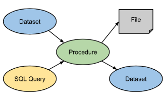
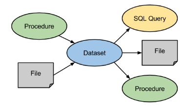

# MLDB
 
Die MLDB ist eine open-source Datenbank, welche von Element AI für den Bereich Machine Learning entworfen wurde. Zusammenfassend bietet die MLDB die folgenden Eigenschaften:
-   Frei zugänglich (open-source)
-   SQL Datenbank, welche in C++ geschrieben wurde
-   Web Nativ – primäre API im JSON Format über REST API/ HTTP zugänglich
-   Ende-zu-Ende Lösung – Daten werden eigelesen, das Modell trainiert und entwickelt
-   Unterstützt Big Data – kann Modelle mit Milliarden von Datenpunkten trainieren
-   Kosteneffizient – schnelles Lernen möglich (ohne Clustering)
 
Die Funktionsweise der MLDB wird in der nachfolgenden Abbildung dargestellt. Das Dataset wird mit einem Data File gespeist. Die Procedures laufen über dieses Dataset und erstellen einen Model File, welche in eine Function eingespeist werden. Diese Functions werden dadurch parametrisiert und können mit Hilfe von SQL oder über eine REST API ausgelesen werden [61].

 

Abbildung: Funktionsweise MLDB

Quelle: [61]

Nachfolgend wird die Funktionsweise von Functions, Procedures, Data Sets und Files näher erläutert.

## Functions

 

Abbildung: Functions

Quelle: [61]

Functions (dt. Funktionen) sind wiederverwendbare Programme, die nach ihrer Funktion benannt werden. Sie werden dazu verwendet, SQL Ausdrücke zu kapseln und Machine Learning Modelle anzuwenden, die zuvor von Procedures parametrisiert wurden. Alle entwickelten MLDB Functions können mit Hilfe von REST Endpoints (dt. Endpunkten) abgefragt werden. Dies ermöglicht die Anwendung von Machine Learning Modellen in Echtzeit. Zudem können diese Functions in SQL-Queries (dt. SQL-Abfragen) genutzt werden, um effizient Machine Learning Modelle auf Daten mit Hilfe von Batch-Prozessen anzuwenden [61]. 

## Procedures

 

Abbildung: Procedures

Quelle: [61]

Procedures (dt. Prozeduren) sind ebenfalls wiederverwendbare Programme, die nach ihrer Funktion benannt werden. Sie werden dazu verwendet langwierige Batch-Operationen auszuführen, welche keine Rückgabewerte liefern. Procedures laufen prinzipiell über Data Sets (dt. Datensätze) und können mit Hilfe von SQL Ausdrücken konfiguriert werden. Grundsätzlich werden Procedures zum Transformieren oder Aufräumen von Daten, das Training von Machine Learning Modellen und das Anwenden von Batch-Prozessen auf Maschinenmodelle verwendet [61].

## Data Sets

 

Abbildung: Data Sets 

Quelle: [61]

Data Sets (dt. Datensätze) bestehen aus mehreren Datenpunkten, die sich aus Tupeln (Zeile, Spalte, Zeitstempel und Wert) zusammensetzen. Sie können aus Millionen Zeilen und Spalten bestehen und Datenpunkte mit Zahlen oder Text enthalten. Data Sets können aus Files (dt. Dateien) gelesen und auch geschrieben werden. Zudem können sie als Eingabewerte für Procedures dienen oder auch aus Procedures generiert werden. Data Sets können außerdem mit Hilfe von SQL-Ausdrücken durchsucht werden. Data Sets werden in MLDB als dreidimensionale Matrizen betrachtet. Dabei werden Zeilen, Spalten und Zeitstempel als Dimensionen verwendet. Die folgende Abbildung zeigt diese Strukturierung. Demzufolge gibt es je Zeitstempel ein eigenes Data Set [61].

Abbildung: Schaubild Data Set 

Quelle: [61]

---

[61]  https://docs.mldb.ai/doc/#builtin/Overview.md.html

---

[< Anwendungsbeispiele](Anwendungsbeispiele.md) | [ Fazit >](Fazit.md)
