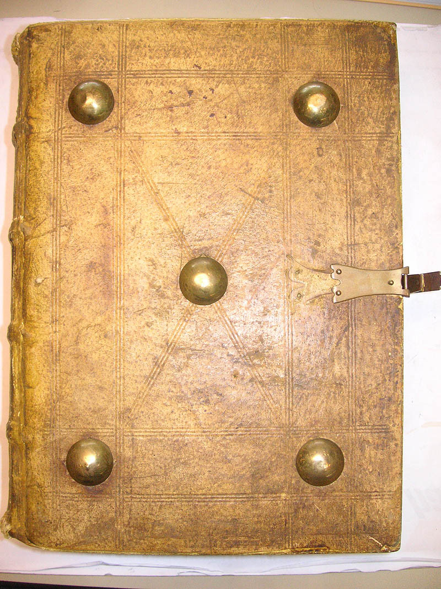
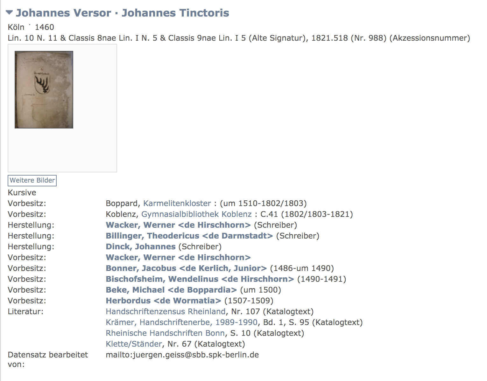
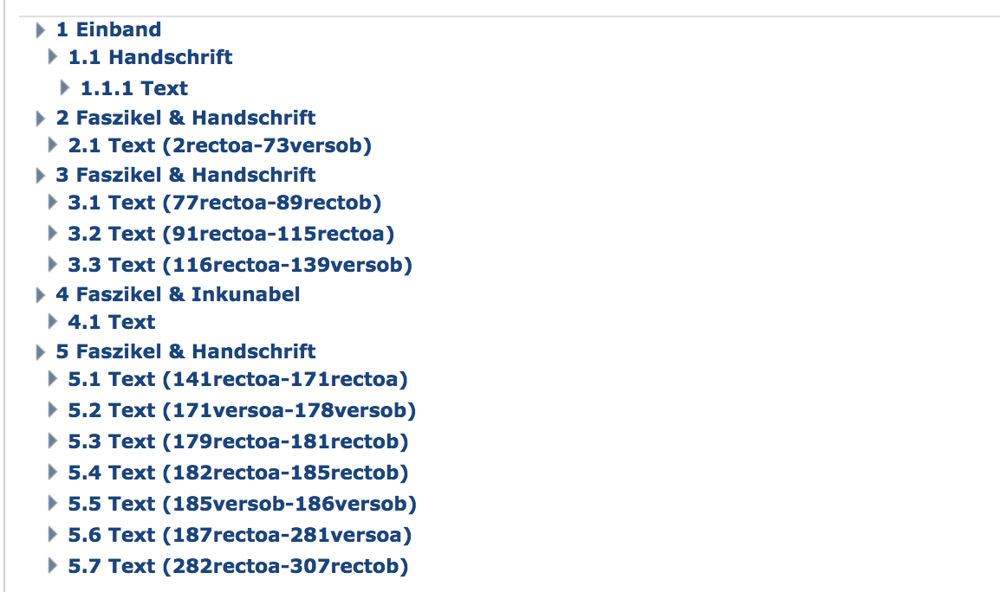
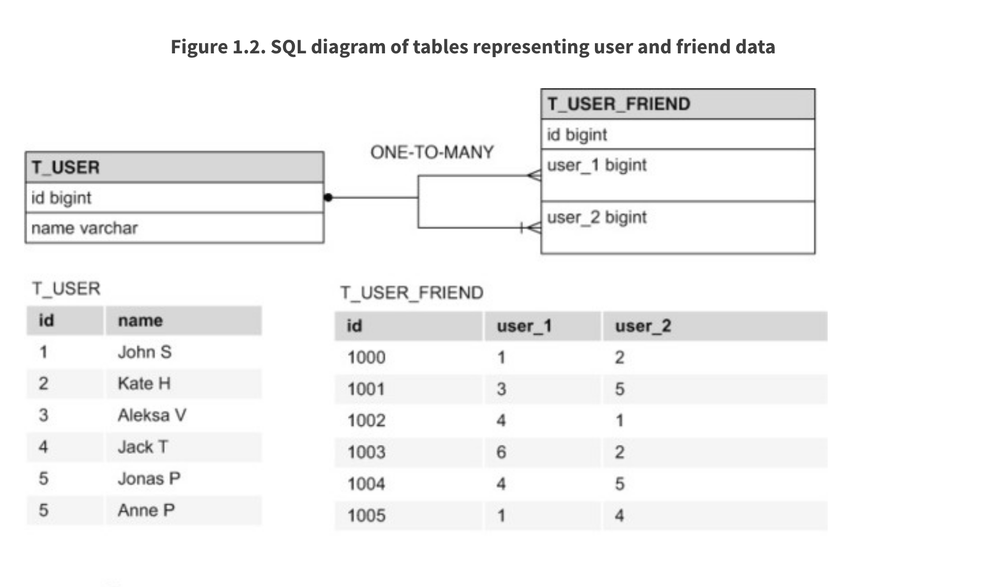
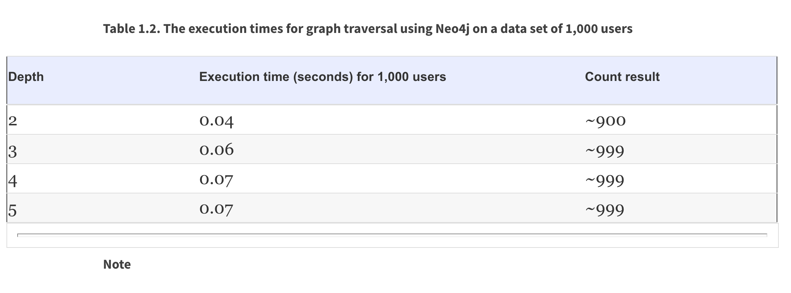

# 3. Projektvorstellung / Bibliothek mittelalterliche Handschriften
Die Staatsbibliothek zu Berlin ermöglicht den ortsunabhängigen und kostenfreien Zugang zu den Ergebnissen der Handschriftenkatalogisierung im deutschen Sprachraum. Alle Metadaten der abendländischen mittelalterlichen Handschriften
sollen in diesem Projekt als Datengrundlage verwendet werden. Die Metadaten beschreiben den Handschriftenbestand und liegen in Form von XML Dateien vor. Diese Daten sollen in ein sehr vereinfachtes Datenmodell überführt und 
in den entsprechenden Datenbanksystemen persitiert werden. 

## 3.2 Technologie Stack

Um die theoretischen Fragestellungen praktisch evaluieren zu können wurde ein Java Enterprise Projekt mit Hilfe des [Spring Frameworks](https://spring.io/) aufgesetzt. 
Um in kurzer Zeit eine lauffähige Serverumgebung zu bekommen wurde [Spring Boot](https://docs.spring.io/spring-boot/docs/current/reference/html/) mit einem integriertem Tomcat Servlet Container als Laufzeitumgebung eingesetzt. Als Build Werkzeug 
kommt [Gradle](https://gradle.org/) zum Einsatz. Der gesamte Quellcode wird mit Hilfe des Versionierungssystem [Git](https://git-scm.com/) auf der Github Platform verwaltet.  

Um die relevanten Datenbanksystem zur Verfügung zu stellen haben wir uns entschieden [Docker](https://www.docker.com/) als Container Technologie zu verwenden. So konnten wir sehr leicht eine relationale Postgres Datenbank
und eine NEO4J Graphendatenbank anbinden. Um die Daten in diesen System zu persistieren wurden die ORM Bibliotheken [Spring NEO4J](https://spring.io/guides/gs/accessing-data-neo4j/) und [Spring Data](https://spring.io/projects/spring-data) verwendet. 

## 3.3 Domainmodell 

Das Datenmodell dieses Projektes besteht aus folgenden Komponenten: 

  *  **Beschreibungsdokument**: Enthält alle Metadaten zu einer abendländischen Handschriftenbeschreibung. Es stellt im Context von Domain Driven Design das Root Aggregate dar. 
  *  **Dokumentenelement**: Ist ein inhaltlicher Bestandteil einer Beschreibung. Das kann Textabschnitt zur Beschreibung eines Einbandes oder eine Sammlung von Texten sein. 
  *  **Beteiligte**:  Ist ein abstraktes Element um gemeinsame Normdatenattribute für Personen und Koerperschaften zu verwalten. 
  *  **Ort**: Informationen zu einem Ort. 
  *  **Person**: Informationen zu einer Person, was in diesem Kontext ein Autor oder ein Besitzer einer Handschrift sein kann. 
  *  **Koerperschaft**: Informationen zu einer Institution. 
  *  **Provenienz**: Zeitlich begrenztes Besitzverhältnis. 
  *  **Digitalisat**: Ergebnis eines Digitalisierungsprozesses. In der Regel eine Bilddatei für eine Seite bzw. eines Handschriftenbestandteiles.
  
Das Beschreibungsdokument führt mehrere Objekte zusammen und verwaltet dieses. Ein Beschreibungsdokument besteht aus einer Hierarchie von Dokumentenelementen und den wichtigsten Metadaten. Zu jeder Handschrift werden Daten 
zu folgenden wichtigen Informationen erfasst: 

  * Titel: [Johannes Versor, Johannes Tinctoris](http://www.manuscripta-mediaevalia.de/#|5)
  * Signatur: S 67
  * Entstehungsdatum: 1460 
  * Bestandhaltende Einrichtung: Bonn, Universitäts- und Landesbibliothek Bonn
  * Dokumentenbestandteile
  * Provenienz
  * Buchbinder 

Nachfolgende Grafiken zeigen die fachliche Struktur einer Handschriftenbeschreibung. 

Beispiel: Dokumentenelement Text

 

Anhand dieses Beispiel wurde kurz die fachliche Struktur einer Handschriftenbeschreibung dargestellt. Zu erkennen ist, das ein Dokument viele Beziehungen zu Orten, Personen, Instiutionen mit zeitlicher Varianz haben kann. 
  
## 3.4 Unterschiede in der Implementierung 

### 3.4.1 Objekt Mapping für RDBMS und Graphdatenbank
Alle Bestandteile des Datenmodells wurden mit den entsprechenden Annotation der der ORM Frameworks ausgezeichnet, sodass der OR - Mapper diese persistieren kann. Nachfolgende soll die Beschreibungsentität kurz erläutert werden: 

    @Entity
    @Table(name = "beschreibungen")
    @NodeEntity
    public class Beschreibungsdokument {
    
      protected Beschreibungsdokument() {
      }
    
      public Beschreibungsdokument(String id, String titel, String signatur) {
        this.id = id;
        this.titel = titel;
        this.signatur = signatur;
        this.bestandteile = new HashSet<>();
        this.orte = new HashSet<>();
      }
    
      @javax.persistence.Id
      @Id
      private String id;
    
      @Column(length = 4096)
      private String titel;
    
      private String signatur;
    
      @ManyToMany(fetch = FetchType.EAGER)
      private Set<Ort> orte;
    
      @ManyToOne(fetch = FetchType.EAGER)
      @Relationship(type = "BUCHBINDER")
      private Beteiligte buchbinder;
    
      @OneToMany(fetch = FetchType.EAGER, cascade = {CascadeType.ALL})
      @Relationship(type = "ENTHAELT")
      private Set<DokumentElement> bestandteile;
      

**Annotation für GRAPH Datenbank** 

Ein Neo4J Knoten wird durch die Annotation **@NodeEntity** gekennzeichnet. Zusätzlich benötigt ein Knoten eine eindeutige Identifikationsnummer. Eine Beziehung zu anderen Knoten wird 
mit Hilfe der Annotation **@Relationship** gekennzeichnet. Mit Hilfe dieser Annotationen kann ein Objekt Graph Mapper, wie er im Spring Data Neo4J verwendet wird dieses Objekt in einer Graphendatenbank persistieren. 

#### 3.4.1.1 Objekt Mapping, Besonderheit RelationshipEntity

Eine Besonderheit im Bereich der Graphendatenbank stellt hierbei das Objekt Provienz dar. Dieses Objekt ist ein Relationsobjekt **@RelationshipEntity()** welches zwei Entitäten miteinander verbindet. Ein solches Objekt gibt es im Kontext des RDBMS nicht. 

    @Entity
    @RelationshipEntity()
    public class Provenienz {
  
    protected Provenienz() {
    }
  
    public Provenienz(String id,ProvenienzTyp typ,
        Beteiligte beteiligte, String vonJahr, String bisJahr, Beschreibungsdokument beschreibungsdokument) {
      this.id = id;
      this.typ = typ;
      this.beteiligte = beteiligte;
      this.vonJahr = vonJahr;
      this.bisJahr = bisJahr;
      this.beschreibungsdokument = beschreibungsdokument;
    }
  
    @javax.persistence.Id
    @Id
    private String id;
  
    @Enumerated
    private ProvenienzTyp typ;
  
    @ManyToOne(fetch = FetchType.EAGER)
    @EndNode
    private Beteiligte beteiligte;
  
    private String vonJahr;
  
    private String bisJahr;
  
    @OneToOne(fetch = FetchType.EAGER)
    @StartNode
    private Beschreibungsdokument beschreibungsdokument;
    
Die Provienz verbindet hierbei die Entitäten Beschreibungsdokument und Beteiligte in einer gerichtet Form. Die Richtung wird durch die Annotationen **@StartNode** und **@EndNode** gekennzeichnet. 

#### 3.4.1.2 Objekt Mapping, Besonderheit Vererbung 

In unserem Beispiel spielt für folgende Objekt die Vererbung im Sinne der Objektorientierten Programmierung eine Rolle. Die Objekte Ort, Koerperschaft und Person sind alle vom Typ Beteiligte. 

    public class Ort extends Beteiligte
    public class Koerperschaft extends Beteiligte
    public class Person extends Beteiligte
    
Für ein relationales Datenbanksystem muss eine Strategie festgelegt werden, in wieviel Tabellen die Daten vom Typ Beteiligte abgelegt werden. 

    Entity
    @Table(name = "beteiligte")
    @Inheritance(strategy = InheritanceType.TABLE_PER_CLASS)
    public abstract class Beteiligte {

In unserem Beispiel wird für jede Entität vom konkreten Typ eine Tabelle angelegt. So enthät die spätere Datenbank eine Tabelle Person, Ort und Körperschaft. Weitere Möglichkeiten die Daten 
im RDBMS abzulegen sind: 

  * SINGLE_TABLE, Eine Tabelle für alle Typen von Beteiligte 
  * JOINED, Eine Tabelle für gemeinsame Attribute und jeweils eine Tabelle für Typ spezifische Attribute. Diese werden mit einem Join verbunden. 
  
Für die Graphendatenbank werden hier keine Steuerungsangaben benötigt. Jeder Knoten ist lediglich von dem konkreten Typ und der abstrakte Typ Beteiligte findet keine Verwendung. 

**Annotationen für RDBMS** 

Ein Objekt welches in eine relationale Datenbank persistiert werden soll, muss mit der Annotation **@Entity** gekennzeichnet werden. Genau wie bei Neo4J muss dieses Objekt ein Attribute mit der **@Id** Annotation als primäry Key kennzeichnen. 
Für Beziehungen zu anderen Objekten stehen folgende Annotationen zur Verfügung: **@OneToOne**, **@OneToMany**, **@ManyToOne**, **@ManyToMany**. Für diese Annotationen müssen noch Werte für das Verhalten beim Laden angegeben werden. Zusätzlich können Daten zusammenhänged 
gespeichert, gelöscht oder geladen werden was die Arbeit mit Objekten des ORM in der Praxis oft komplex werden lässt. 

Bei der Konfiguration der Objekt Mapper scheint das relationale Datenbankmanagementsystem mehr Steuerung zu benötigen als die Graphendatenbank.

### 3.4.2 CREAD, READ, UPDATE and DELETE (CRUD) für RDBMS und Graphdatenbank

Mit Spring Data bekommt der Entwickler eine der einfachsten Möglichkeiten für die Umsetzung der CRUD Operation an die Hand die es meiner Meinung nach gibt. Für jede Entität die durch Spring Data verwaltet werden soll muss lediglich 
ein CRUDRepository erweitert werden. 

**Beispiel NEO4J**

    public interface BeschreibungsdokumentGraphRepository extends Neo4jRepository<Beschreibungsdokument,String> {
    
    }

**Beispiel RDBMS**
  
    public interface BeschreibungsdokumenteRDBMSRepository extends CrudRepository<Beschreibungsdokument,String> {
    
    }

Die Implementierung dieser Interfaces wird durch Spring Data selbst vorgenommen. Mit Hilfe von Generics muss im Interface lediglich der Typ der Entität und der Typ des Primärschlüssels angebeben werden. In beiden Fällen ist dies jeweils
die Klasse Beschreibungsdokument und die Klasse String. Die Verwendung des Repositories ist in beiden Fällen sehr einfach: 

      @Autowired
      private BeschreibungsdokumentGraphRepository beschreibungsdokumentGraphRepository;
    
      @Autowired
      private BeschreibungsdokumenteRDBMSRepository beschreibungsdokumenteRDBMSRepository;
      
      beschreibungsdokumentGraphRepository.deleteAll();
      
      beschreibungsdokumenteRDBMSRepository.deleteAll();
      
      beschreibungsdokumentGraphRepository.saveAll(l);
      
      beschreibungsdokumenteRDBMSRepository.saveAll(l);
      
Im ersten Schritt muss die Implementierng via Dependency Injection einer Variable zugewiesen werden. Anschließend können die Entitäten mit save, delete, oder findBy Methoden in die entsprechende Datenbank 
persistiert, gelöscht oder aktualisiert werden. Für die Verwendung der Standard Operation macht es hierbei keinen Unterschied ob diese auf einer Graphendatenbank oder einem relationales DBMS durchgeführt werden.

      
### 3.4.3 Queries für RDBMS und Graphdatenbank

In einem relationalen Datenbankmanagementsystem wird [Structured Query Language](https://de.wikipedia.org/wiki/SQL) als Datenbanksprache verwendet. SQL Befehle lassen sich in vier Kategorien einteilen: 

  *  Data Query Language: Befehle zur Abfrage und Aufbereitung
  *  Data Manipulation Language: Befehle zum Einfügen, Aktualisieren und Löschen von Daten
  *  Data Definition Language: Befehle zur Schema Definition
  *  Data Control Language: Befehle zur Rechteverwaltung und Transaktionskontrolle. 
  
In diesem Kapitel sollen primär die Befehle zur Abfrage mit den der Graphendatenbank verglichen werden. 

Eine Graphdatenbank wie Neo4j kann mit Hilfe der Graphdatenbanksprache [Cypher](https://neo4j.com/cypher-graph-query-language/) abgefragt und manipuliert werden. Cypher ist SQL sehr ähnlich 
und für einen Entwickler mit RDBMS Erfahrung sehr leicht zu lernen. 

Grundsätzlich müssen mit dem Einsatz von Spring Data die einfachen Befehle zur Abfragen und Manipulation nicht mehr selbst geschrieben werden. Wie im vorhergehenden Kapitel beschrieben steht dafüt das CRUDRepository zur Verfügung. Allerdings bietet Spring Data 
für beide Datenbanksysteme die Möglichkeit eigene Queries zu formulieren. 

Nachfolgendes Codebeispiel zeigt die Implementierung einer CRUD und einer nativen Query einmal für ein RDBMS und einmal für ein Graphendatenbanksystem. 

    public interface BeschreibungsdokumenteRDBMSRepository extends CrudRepository<Beschreibungsdokument,String> {
    
      List<Beschreibungsdokument> findByTitelAndSignatur(String titel, String signatur);
    
      @Query(value = "SELECT beschreibung FROM Beschreibungsdokument WHERE beschreibung.titel like %?1 AND beschreibung.signatur like %?2", nativeQuery = true)
      List<Beschreibungsdokument> findBeschreibungenWithTitelAndSignatur(String titel, String signatur);
    
    }
    
    
    public interface BeschreibungsdokumentGraphRepository extends Neo4jRepository<Beschreibungsdokument,String> {
    
      List<Beschreibungsdokument> findByTitelAndSignatur(String titel, String signatur);
    
      @Query("MATCH (b:Beschreibungsdokument{titel:{titel} & signatur:{signatur}})-[:r]->(n) return b")
      List<Beschreibungsdokument> findWithTitelAndSignatur(String titel, String signatur);
    }
    
Grundsätzlich lassen sich mit Hilfe des Frameworks Spring Data native Queries für beide Datenbanksysteme sehr leicht implementieren. Die Unterstützung der Standardoperation ist ebenfalls sehr gut. Allerdings bietet die Graphendatenbank 
mit Hilfe des Return Statements noch eine Möglichkeit individuelle Ergebnisse zurück zugeben. Die Möglichkeit besteht für die relationale Datenbank nicht. Folgendes Beispiel zeigt dies anhand der Provienz: 

    @Query("MATCH (k:Koerperschaft)-[r:PROVENIENZ]-(b:Beschreibungsdokument) RETURN k AS beteiligte,r AS provenienz,b AS beschreibungsdokument")
      List<ProvenienzResult> findAllProvenienz();
      
    
    @QueryResult
    public class ProvenienzResult {
    
      Beteiligte beteiligte;
    
      Provenienz provenienz;
    
      Beschreibungsdokument beschreibungsdokument;
    
      @Override
      public boolean equals(Object o) {
        if (this == o) {
          return true;
        }
        if (o == null || getClass() != o.getClass()) {
          return false;
        }
        ProvenienzResult that = (ProvenienzResult) o;
        return Objects.equals(beteiligte, that.beteiligte) &&
            Objects.equals(provenienz, that.provenienz) &&
            Objects.equals(beschreibungsdokument, that.beschreibungsdokument);
      }
    
      @Override
      public int hashCode() {
        return Objects.hash(beteiligte, provenienz, beschreibungsdokument);
      }
    
      public Beteiligte getBeteiligte() {
        return beteiligte;
      }
    
      public void setBeteiligte(Beteiligte beteiligte) {
        this.beteiligte = beteiligte;
      }
    
      public Provenienz getProvenienz() {
        return provenienz;
      }
    
      public void setProvenienz(Provenienz provenienz) {
        this.provenienz = provenienz;
      }
    
      public Beschreibungsdokument getBeschreibungsdokument() {
        return beschreibungsdokument;
      }
    
      public void setBeschreibungsdokument(
          Beschreibungsdokument beschreibungsdokument) {
        this.beschreibungsdokument = beschreibungsdokument;
      }
    }

Diese Abfrage gibt als Ergebnis ein Objekt zurück welches die Knoten Beteiligte und Beschreibungsdokument sowie die Beziehung Provienz enthält. Diese Flexibilität ermöglicht es für den Einsatz 
einer Graphendatenbank sehr leicht beliebige Ergebnisobjekte zu erschaffen. So können sehr leicht neue Informationen aus den Daten gewonnen werden ohne die Datenbankstruktur anpassen zu müssen.

### 3.4.3 Schema Management für RDBMS und Graphdatenbank

Beide OR Mapper können das Schema automatisch verwalten. Dies bedeutet, dass sowohl die Tabellen als auch die Knoten und Beziehungen automatische angelegt werden. Allerdings benötigt der RDBMS OR Mapper 
eine Einstellung zur Steuerung ob das Schema der Datenbank automatisch oder manuell angelegt werden soll. 

    spring.jpa.hibernate.ddl-auto=update

Die OR-Mapper Implementierung Hibernate benötigt hier die Einstellung für die Schema Verwaltung. Folgende Werte sind dabei zulässig: 

  * Update: Nur Änderungen werden durchgeführt
  * Validate:Das Schema wird lediglich validiert aber nicht verwaltet.  
  * Create: Das Schema wird mit jeder Initialisierung erstellt. 
  * Create-Drop: Das Schema wird mit jeder Initialisierung erstellt und dem Herunterfahren gelöscht.
  
Der OR Graphmapper benötigt diese Einstellungen nicht. Ein Schmema der Graphendatenbank besteht lediglich aus der Definition von Inizes und Constraints. Die Strukturen der Knoten und Beziehungen werden automatisch angelegt. 

Automatische Anpassungen am Schema sind sowohl für RDBMS als auch für Graphendatenbanken nicht für produktive Datenbanken empfohlen. Daher sollten die Schema Änderungen mit Hilfe eines Tools oder manuell durchgeführt werden. Populäre Werkzeuge sind das Google Tool [Flyway](https://flywaydb.org/getstarted/) oder 
[Liquibase](https://www.liquibase.org/). Nur das Tool Liqiubase bietet Unterstützung für die Änderungen in einer [Graphendatenbank](https://www.liquigraph.org/).   

RDBMS Strukturen sind wesentlich starrer und aufwendiger zu betreuen als das Schema einer Graphendatenbank. Dies gilt auch für den Einsatz mit Hilfe eines OR Mappers. 

## 4 Untersuchungen ##
### 4.1 Abfragen an konkreten Daten, SQL versus Cypher ##

In diesem Kapitel möchten wir Anhand eines konkreten Beispiels die Abfragesprachen beider RDBM System mit einander vergleichen. Dazu werden wir mit einem einfachen Beispiel beginnen und dieses immer weiter ausbauen. 

   1. Anzeigen eines Beschreibungsdokumentes. 

    SQL: SELECT * FROM  WHERE id = '31275197'
    
 <table>
 <tr><th>id</th><th>signatur</th><th>titel</th><th> buchbinder_name</th></tr>
 <tr><td>31275197</td><td>S 67</td><td>Johannes Versor Johannes Tinctoris</td><td>Buchbinder Boppard Karmeliten</td>
 </table>
     
    
    CYPHER: MATCH (b:Beschreibungsdokument {id:'31275197'}) RETURN b as beschreibung;
    

    
    
Gut zu erkennen ist, dass im Ergebnis der SQL Abfrage der primary key der Tabelle der beteiligten Buchbinder mit enthalten ist. Um ein identisches Ergebnis zu erhalten, müssten mit Hilfe der Selektion die 
entsprechenden Spalten im SQL definiert werden. Das Ergebnis der Cypher Abfrage enthält hingegen noch zusätzliche Metadaten, welche das Datenbanksystem automatisch angelegt hat. Diese sind: 

  * label: Kennzeichnung eines Knotentyps 
  * id: Interne Datenbankid
  * properties: Enthält alle Werte des Knotens.
  
   2. Anzeigen eines Beschreibungsdokumentes und des dazugehörigen Buchbinder.
 
    SQL: SELECT * FROM beschreibungen INNER JOIN koerperschaft 
         ON buchbinder_name = koerperschaft.name
         WHERE beschreibungen.id = '31275197'  

<table border="1" style="border-collapse:collapse">
<tr><th>id</th><th>signatur</th><th>titel</th><th>buchbinder_name</th><th>name</th><th>bemerkung</th><th>gndid</th><th>id</th><th>ort_name</th></tr>
<tr><td>31275197</td><td>S 67</td><td>Johannes Versor · Johannes Tinctoris</td><td>Buchbinder Boppard Karmeliten</td><td>Buchbinder Boppard Karmeliten</td><td>NULL</td><td>NULL</td><td>31275175</td><td>Boppard</td></tr></table>

    CYPHER: MATCH (b:Beschreibungsdokument {id:'31275197'})-[r:BUCHBINDER]-(k) RETURN b as beschreibung,k;
    

An diesem Beispiel ist bereits zu erkennen, dass die SQL Query etwas aufwendiger und umfangreicher ist, als die Cypher Query. 

   3. Anzeigen eines Beschreibungsdokumentes und den dazugehörigen Daten vom Buchbinder, Ort und Dokumentenelementen.
   
   
    SQL:  SELECT beschreibungen.id,signatur,titel,koerperschaft.name,orte_name,e.name FROM beschreibungen
                  LEFT JOIN koerperschaft ON buchbinder_name = koerperschaft.name
                  LEFT JOIN beschreibungen_orte on beschreibungen.id = beschreibungen_orte.beschreibungsdokument_id
                  LEFT JOIN beschreibungen_bestandteile bb on beschreibungen.id = bb.beschreibungsdokument_id
                  LEFT JOIN elemente e on bb.bestandteile_id = e.id
              WHERE beschreibungen.id = '31275197'

<table border="1" style="border-collapse:collapse">
<tr><th>id</th><th>signatur</th><th>titel</th><th>name</th><th>orte_name</th><th>name</th></tr>
<tr><td>31275197</td><td>S 67</td><td>Johannes Versor · Johannes Tinctoris</td><td>Buchbinder Boppard Karmeliten</td><td>Trier</td><td>Faszikel &amp; Inkunabel</td></tr>
<tr><td>31275197</td><td>S 67</td><td>Johannes Versor · Johannes Tinctoris</td><td>Buchbinder Boppard Karmeliten</td><td>Trier</td><td>Faszikel &amp; Handschrift</td></tr>
<tr><td>31275197</td><td>S 67</td><td>Johannes Versor · Johannes Tinctoris</td><td>Buchbinder Boppard Karmeliten</td><td>Trier</td><td>Faszikel &amp; Handschrift</td></tr>
<tr><td>31275197</td><td>S 67</td><td>Johannes Versor · Johannes Tinctoris</td><td>Buchbinder Boppard Karmeliten</td><td>Trier</td><td>Faszikel &amp; Handschrift</td></tr>
<tr><td>31275197</td><td>S 67</td><td>Johannes Versor · Johannes Tinctoris</td><td>Buchbinder Boppard Karmeliten</td><td>Trier</td><td>Einband</td></tr>
<tr><td>31275197</td><td>S 67</td><td>Johannes Versor · Johannes Tinctoris</td><td>Buchbinder Boppard Karmeliten</td><td>Köln</td><td>Faszikel &amp; Inkunabel</td></tr>
<tr><td>31275197</td><td>S 67</td><td>Johannes Versor · Johannes Tinctoris</td><td>Buchbinder Boppard Karmeliten</td><td>Köln</td><td>Faszikel &amp; Handschrift</td></tr>
<tr><td>31275197</td><td>S 67</td><td>Johannes Versor · Johannes Tinctoris</td><td>Buchbinder Boppard Karmeliten</td><td>Köln</td><td>Faszikel &amp; Handschrift</td></tr>
<tr><td>31275197</td><td>S 67</td><td>Johannes Versor · Johannes Tinctoris</td><td>Buchbinder Boppard Karmeliten</td><td>Köln</td><td>Faszikel &amp; Handschrift</td></tr>
<tr><td>31275197</td><td>S 67</td><td>Johannes Versor · Johannes Tinctoris</td><td>Buchbinder Boppard Karmeliten</td><td>Köln</td><td>Einband</td></tr></table>

    Cypher: MATCH (b:Beschreibungsdokument {id:'31275197'})-[r:BUCHBINDER|:ENTHAELT|:ORTE]-(k) RETURN b,r,k;

4. Anzeigen eines Beschreibungsdokumentes und allen dazugehörigen Daten.

        SQL:   SELECT DISTINCT beschreibungen.id,signatur,titel,koerperschaft.name as buchbinder,orte_name,e.name as element, p.von_jahr, p.bis_jahr, p.beteiligte_name FROM beschreibungen
                  LEFT JOIN koerperschaft ON buchbinder_name = koerperschaft.name
                  LEFT JOIN beschreibungen_orte on beschreibungen.id = beschreibungen_orte.beschreibungsdokument_id
                  LEFT JOIN beschreibungen_bestandteile bb on beschreibungen.id = bb.beschreibungsdokument_id
                  LEFT JOIN elemente e on bb.bestandteile_id = e.id
                  LEFT JOIN provenienz p on beschreibungen.id = p.beschreibungsdokument_id
               WHERE beschreibungen.id = '31275197'

<table border="1" style="border-collapse:collapse">
<tr><th>id</th><th>signatur</th><th>titel</th><th>buchbinder</th><th>orte_name</th><th>element</th><th>von_jahr</th><th>bis_jahr</th><th>beteiligte_name</th></tr>
<tr><td>31275197</td><td>S 67</td><td>Johannes Versor · Johannes Tinctoris</td><td>Buchbinder Boppard Karmeliten</td><td>Köln</td><td>Einband</td><td></td><td></td><td>Beke, Michael de Boppardia</td></tr>
<tr><td>31275197</td><td>S 67</td><td>Johannes Versor · Johannes Tinctoris</td><td>Buchbinder Boppard Karmeliten</td><td>Köln</td><td>Einband</td><td></td><td></td><td>Billinger, Theodericus de Darmstadt</td></tr>
<tr><td>31275197</td><td>S 67</td><td>Johannes Versor · Johannes Tinctoris</td><td>Buchbinder Boppard Karmeliten</td><td>Köln</td><td>Einband</td><td></td><td></td><td>Bischofsheim, Wendelinus de Hirschhorn</td></tr>
<tr><td>31275197</td><td>S 67</td><td>Johannes Versor · Johannes Tinctoris</td><td>Buchbinder Boppard Karmeliten</td><td>Köln</td><td>Einband</td><td></td><td></td><td>Bonner, Jacobus de Kerlich, Junior</td></tr>
<tr><td>31275197</td><td>S 67</td><td>Johannes Versor · Johannes Tinctoris</td><td>Buchbinder Boppard Karmeliten</td><td>Köln</td><td>Einband</td><td></td><td></td><td>Dinck, Johannes</td></tr>
<tr><td>31275197</td><td>S 67</td><td>Johannes Versor · Johannes Tinctoris</td><td>Buchbinder Boppard Karmeliten</td><td>Köln</td><td>Einband</td><td></td><td></td><td>Herbordus de Wormatia</td></tr>
<tr><td>31275197</td><td>S 67</td><td>Johannes Versor · Johannes Tinctoris</td><td>Buchbinder Boppard Karmeliten</td><td>Köln</td><td>Einband</td><td></td><td></td><td>Wacker, Werner de Hirschhorn</td></tr>
<tr><td>31275197</td><td>S 67</td><td>Johannes Versor · Johannes Tinctoris</td><td>Buchbinder Boppard Karmeliten</td><td>Köln</td><td>Einband</td><td>1802/1803-1821</td><td></td><td>Gymnasialbibliothek Koblenz</td></tr>
<tr><td>31275197</td><td>S 67</td><td>Johannes Versor · Johannes Tinctoris</td><td>Buchbinder Boppard Karmeliten</td><td>Köln</td><td>Einband</td><td>seit 1821</td><td>2019</td><td>Universitäts- und Landesbibliothek Bonn</td></tr>
<tr><td>31275197</td><td>S 67</td><td>Johannes Versor · Johannes Tinctoris</td><td>Buchbinder Boppard Karmeliten</td><td>Köln</td><td>Einband</td><td>um 1510-1802/1803</td><td></td><td>Karmelitenkloster</td></tr>
<tr><td>31275197</td><td>S 67</td><td>Johannes Versor · Johannes Tinctoris</td><td>Buchbinder Boppard Karmeliten</td><td>Köln</td><td>Faszikel &amp; Handschrift</td><td></td><td></td><td>Beke, Michael de Boppardia</td></tr>
<tr><td>31275197</td><td>S 67</td><td>Johannes Versor · Johannes Tinctoris</td><td>Buchbinder Boppard Karmeliten</td><td>Köln</td><td>Faszikel &amp; Handschrift</td><td></td><td></td><td>Billinger, Theodericus de Darmstadt</td></tr>
<tr><td>31275197</td><td>S 67</td><td>Johannes Versor · Johannes Tinctoris</td><td>Buchbinder Boppard Karmeliten</td><td>Köln</td><td>Faszikel &amp; Handschrift</td><td></td><td></td><td>Bischofsheim, Wendelinus de Hirschhorn</td></tr>
<tr><td>31275197</td><td>S 67</td><td>Johannes Versor · Johannes Tinctoris</td><td>Buchbinder Boppard Karmeliten</td><td>Köln</td><td>Faszikel &amp; Handschrift</td><td></td><td></td><td>Bonner, Jacobus de Kerlich, Junior</td></tr>
<tr><td>31275197</td><td>S 67</td><td>Johannes Versor · Johannes Tinctoris</td><td>Buchbinder Boppard Karmeliten</td><td>Köln</td><td>Faszikel &amp; Handschrift</td><td></td><td></td><td>Dinck, Johannes</td></tr>
<tr><td>31275197</td><td>S 67</td><td>Johannes Versor · Johannes Tinctoris</td><td>Buchbinder Boppard Karmeliten</td><td>Köln</td><td>Faszikel &amp; Handschrift</td><td></td><td></td><td>Herbordus de Wormatia</td></tr>
<tr><td>31275197</td><td>S 67</td><td>Johannes Versor · Johannes Tinctoris</td><td>Buchbinder Boppard Karmeliten</td><td>Köln</td><td>Faszikel &amp; Handschrift</td><td></td><td></td><td>Wacker, Werner de Hirschhorn</td></tr>
<tr><td>31275197</td><td>S 67</td><td>Johannes Versor · Johannes Tinctoris</td><td>Buchbinder Boppard Karmeliten</td><td>Köln</td><td>Faszikel &amp; Handschrift</td><td>1802/1803-1821</td><td></td><td>Gymnasialbibliothek Koblenz</td></tr>
<tr><td>31275197</td><td>S 67</td><td>Johannes Versor · Johannes Tinctoris</td><td>Buchbinder Boppard Karmeliten</td><td>Köln</td><td>Faszikel &amp; Handschrift</td><td>seit 1821</td><td>2019</td><td>Universitäts- und Landesbibliothek Bonn</td></tr>
<tr><td>31275197</td><td>S 67</td><td>Johannes Versor · Johannes Tinctoris</td><td>Buchbinder Boppard Karmeliten</td><td>Köln</td><td>Faszikel &amp; Handschrift</td><td>um 1510-1802/1803</td><td></td><td>Karmelitenkloster</td></tr>
<tr><td>31275197</td><td>S 67</td><td>Johannes Versor · Johannes Tinctoris</td><td>Buchbinder Boppard Karmeliten</td><td>Köln</td><td>Faszikel &amp; Inkunabel</td><td></td><td></td><td>Beke, Michael de Boppardia</td></tr>
<tr><td>31275197</td><td>S 67</td><td>Johannes Versor · Johannes Tinctoris</td><td>Buchbinder Boppard Karmeliten</td><td>Köln</td><td>Faszikel &amp; Inkunabel</td><td></td><td></td><td>Billinger, Theodericus de Darmstadt</td></tr>
<tr><td>31275197</td><td>S 67</td><td>Johannes Versor · Johannes Tinctoris</td><td>Buchbinder Boppard Karmeliten</td><td>Köln</td><td>Faszikel &amp; Inkunabel</td><td></td><td></td><td>Bischofsheim, Wendelinus de Hirschhorn</td></tr>
<tr><td>31275197</td><td>S 67</td><td>Johannes Versor · Johannes Tinctoris</td><td>Buchbinder Boppard Karmeliten</td><td>Köln</td><td>Faszikel &amp; Inkunabel</td><td></td><td></td><td>Bonner, Jacobus de Kerlich, Junior</td></tr>
<tr><td>31275197</td><td>S 67</td><td>Johannes Versor · Johannes Tinctoris</td><td>Buchbinder Boppard Karmeliten</td><td>Köln</td><td>Faszikel &amp; Inkunabel</td><td></td><td></td><td>Dinck, Johannes</td></tr>
<tr><td>31275197</td><td>S 67</td><td>Johannes Versor · Johannes Tinctoris</td><td>Buchbinder Boppard Karmeliten</td><td>Köln</td><td>Faszikel &amp; Inkunabel</td><td></td><td></td><td>Herbordus de Wormatia</td></tr>
<tr><td>31275197</td><td>S 67</td><td>Johannes Versor · Johannes Tinctoris</td><td>Buchbinder Boppard Karmeliten</td><td>Köln</td><td>Faszikel &amp; Inkunabel</td><td></td><td></td><td>Wacker, Werner de Hirschhorn</td></tr>
<tr><td>31275197</td><td>S 67</td><td>Johannes Versor · Johannes Tinctoris</td><td>Buchbinder Boppard Karmeliten</td><td>Köln</td><td>Faszikel &amp; Inkunabel</td><td>1802/1803-1821</td><td></td><td>Gymnasialbibliothek Koblenz</td></tr>
<tr><td>31275197</td><td>S 67</td><td>Johannes Versor · Johannes Tinctoris</td><td>Buchbinder Boppard Karmeliten</td><td>Köln</td><td>Faszikel &amp; Inkunabel</td><td>seit 1821</td><td>2019</td><td>Universitäts- und Landesbibliothek Bonn</td></tr>
<tr><td>31275197</td><td>S 67</td><td>Johannes Versor · Johannes Tinctoris</td><td>Buchbinder Boppard Karmeliten</td><td>Köln</td><td>Faszikel &amp; Inkunabel</td><td>um 1510-1802/1803</td><td></td><td>Karmelitenkloster</td></tr>
<tr><td>31275197</td><td>S 67</td><td>Johannes Versor · Johannes Tinctoris</td><td>Buchbinder Boppard Karmeliten</td><td>Trier</td><td>Einband</td><td></td><td></td><td>Beke, Michael de Boppardia</td></tr>
<tr><td>31275197</td><td>S 67</td><td>Johannes Versor · Johannes Tinctoris</td><td>Buchbinder Boppard Karmeliten</td><td>Trier</td><td>Einband</td><td></td><td></td><td>Billinger, Theodericus de Darmstadt</td></tr>
<tr><td>31275197</td><td>S 67</td><td>Johannes Versor · Johannes Tinctoris</td><td>Buchbinder Boppard Karmeliten</td><td>Trier</td><td>Einband</td><td></td><td></td><td>Bischofsheim, Wendelinus de Hirschhorn</td></tr>
<tr><td>31275197</td><td>S 67</td><td>Johannes Versor · Johannes Tinctoris</td><td>Buchbinder Boppard Karmeliten</td><td>Trier</td><td>Einband</td><td></td><td></td><td>Bonner, Jacobus de Kerlich, Junior</td></tr>
<tr><td>31275197</td><td>S 67</td><td>Johannes Versor · Johannes Tinctoris</td><td>Buchbinder Boppard Karmeliten</td><td>Trier</td><td>Einband</td><td></td><td></td><td>Dinck, Johannes</td></tr>
<tr><td>31275197</td><td>S 67</td><td>Johannes Versor · Johannes Tinctoris</td><td>Buchbinder Boppard Karmeliten</td><td>Trier</td><td>Einband</td><td></td><td></td><td>Herbordus de Wormatia</td></tr>
<tr><td>31275197</td><td>S 67</td><td>Johannes Versor · Johannes Tinctoris</td><td>Buchbinder Boppard Karmeliten</td><td>Trier</td><td>Einband</td><td></td><td></td><td>Wacker, Werner de Hirschhorn</td></tr>
<tr><td>31275197</td><td>S 67</td><td>Johannes Versor · Johannes Tinctoris</td><td>Buchbinder Boppard Karmeliten</td><td>Trier</td><td>Einband</td><td>1802/1803-1821</td><td></td><td>Gymnasialbibliothek Koblenz</td></tr>
<tr><td>31275197</td><td>S 67</td><td>Johannes Versor · Johannes Tinctoris</td><td>Buchbinder Boppard Karmeliten</td><td>Trier</td><td>Einband</td><td>seit 1821</td><td>2019</td><td>Universitäts- und Landesbibliothek Bonn</td></tr>
<tr><td>31275197</td><td>S 67</td><td>Johannes Versor · Johannes Tinctoris</td><td>Buchbinder Boppard Karmeliten</td><td>Trier</td><td>Einband</td><td>um 1510-1802/1803</td><td></td><td>Karmelitenkloster</td></tr>
<tr><td>31275197</td><td>S 67</td><td>Johannes Versor · Johannes Tinctoris</td><td>Buchbinder Boppard Karmeliten</td><td>Trier</td><td>Faszikel &amp; Handschrift</td><td></td><td></td><td>Beke, Michael de Boppardia</td></tr>
<tr><td>31275197</td><td>S 67</td><td>Johannes Versor · Johannes Tinctoris</td><td>Buchbinder Boppard Karmeliten</td><td>Trier</td><td>Faszikel &amp; Handschrift</td><td></td><td></td><td>Billinger, Theodericus de Darmstadt</td></tr>
<tr><td>31275197</td><td>S 67</td><td>Johannes Versor · Johannes Tinctoris</td><td>Buchbinder Boppard Karmeliten</td><td>Trier</td><td>Faszikel &amp; Handschrift</td><td></td><td></td><td>Bischofsheim, Wendelinus de Hirschhorn</td></tr>
<tr><td>31275197</td><td>S 67</td><td>Johannes Versor · Johannes Tinctoris</td><td>Buchbinder Boppard Karmeliten</td><td>Trier</td><td>Faszikel &amp; Handschrift</td><td></td><td></td><td>Bonner, Jacobus de Kerlich, Junior</td></tr>
<tr><td>31275197</td><td>S 67</td><td>Johannes Versor · Johannes Tinctoris</td><td>Buchbinder Boppard Karmeliten</td><td>Trier</td><td>Faszikel &amp; Handschrift</td><td></td><td></td><td>Dinck, Johannes</td></tr>
<tr><td>31275197</td><td>S 67</td><td>Johannes Versor · Johannes Tinctoris</td><td>Buchbinder Boppard Karmeliten</td><td>Trier</td><td>Faszikel &amp; Handschrift</td><td></td><td></td><td>Herbordus de Wormatia</td></tr>
<tr><td>31275197</td><td>S 67</td><td>Johannes Versor · Johannes Tinctoris</td><td>Buchbinder Boppard Karmeliten</td><td>Trier</td><td>Faszikel &amp; Handschrift</td><td></td><td></td><td>Wacker, Werner de Hirschhorn</td></tr>
<tr><td>31275197</td><td>S 67</td><td>Johannes Versor · Johannes Tinctoris</td><td>Buchbinder Boppard Karmeliten</td><td>Trier</td><td>Faszikel &amp; Handschrift</td><td>1802/1803-1821</td><td></td><td>Gymnasialbibliothek Koblenz</td></tr>
<tr><td>31275197</td><td>S 67</td><td>Johannes Versor · Johannes Tinctoris</td><td>Buchbinder Boppard Karmeliten</td><td>Trier</td><td>Faszikel &amp; Handschrift</td><td>seit 1821</td><td>2019</td><td>Universitäts- und Landesbibliothek Bonn</td></tr>
<tr><td>31275197</td><td>S 67</td><td>Johannes Versor · Johannes Tinctoris</td><td>Buchbinder Boppard Karmeliten</td><td>Trier</td><td>Faszikel &amp; Handschrift</td><td>um 1510-1802/1803</td><td></td><td>Karmelitenkloster</td></tr>
<tr><td>31275197</td><td>S 67</td><td>Johannes Versor · Johannes Tinctoris</td><td>Buchbinder Boppard Karmeliten</td><td>Trier</td><td>Faszikel &amp; Inkunabel</td><td></td><td></td><td>Beke, Michael de Boppardia</td></tr>
<tr><td>31275197</td><td>S 67</td><td>Johannes Versor · Johannes Tinctoris</td><td>Buchbinder Boppard Karmeliten</td><td>Trier</td><td>Faszikel &amp; Inkunabel</td><td></td><td></td><td>Billinger, Theodericus de Darmstadt</td></tr>
<tr><td>31275197</td><td>S 67</td><td>Johannes Versor · Johannes Tinctoris</td><td>Buchbinder Boppard Karmeliten</td><td>Trier</td><td>Faszikel &amp; Inkunabel</td><td></td><td></td><td>Bischofsheim, Wendelinus de Hirschhorn</td></tr>
<tr><td>31275197</td><td>S 67</td><td>Johannes Versor · Johannes Tinctoris</td><td>Buchbinder Boppard Karmeliten</td><td>Trier</td><td>Faszikel &amp; Inkunabel</td><td></td><td></td><td>Bonner, Jacobus de Kerlich, Junior</td></tr>
<tr><td>31275197</td><td>S 67</td><td>Johannes Versor · Johannes Tinctoris</td><td>Buchbinder Boppard Karmeliten</td><td>Trier</td><td>Faszikel &amp; Inkunabel</td><td></td><td></td><td>Dinck, Johannes</td></tr>
<tr><td>31275197</td><td>S 67</td><td>Johannes Versor · Johannes Tinctoris</td><td>Buchbinder Boppard Karmeliten</td><td>Trier</td><td>Faszikel &amp; Inkunabel</td><td></td><td></td><td>Herbordus de Wormatia</td></tr>
<tr><td>31275197</td><td>S 67</td><td>Johannes Versor · Johannes Tinctoris</td><td>Buchbinder Boppard Karmeliten</td><td>Trier</td><td>Faszikel &amp; Inkunabel</td><td></td><td></td><td>Wacker, Werner de Hirschhorn</td></tr>
<tr><td>31275197</td><td>S 67</td><td>Johannes Versor · Johannes Tinctoris</td><td>Buchbinder Boppard Karmeliten</td><td>Trier</td><td>Faszikel &amp; Inkunabel</td><td>1802/1803-1821</td><td></td><td>Gymnasialbibliothek Koblenz</td></tr>
<tr><td>31275197</td><td>S 67</td><td>Johannes Versor · Johannes Tinctoris</td><td>Buchbinder Boppard Karmeliten</td><td>Trier</td><td>Faszikel &amp; Inkunabel</td><td>seit 1821</td><td>2019</td><td>Universitäts- und Landesbibliothek Bonn</td></tr>
<tr><td>31275197</td><td>S 67</td><td>Johannes Versor · Johannes Tinctoris</td><td>Buchbinder Boppard Karmeliten</td><td>Trier</td><td>Faszikel &amp; Inkunabel</td><td>um 1510-1802/1803</td><td></td><td>Karmelitenkloster</td></tr></table>
 
    CYPHER:  MATCH (b:Beschreibungsdokument {id:'31275197'})-[r]-(k) RETURN b,r,k;
    

Je mehr Beziehungen abgefragt werden müssen, desdo einfacher wird die Anfrageformulierung mit Hilfe von Cypher.

5. Anzeigen eines Beschreibungsdokumentes und allen Dokumentenelemente aller Hierarchien.

        SQL:    WITH RECURSIVE  q as (
                
                    SELECT bb.bestandteile_id,e.name FROM beschreibungen
                    LEFT JOIN beschreibungen_bestandteile bb on beschreibungen.id = bb.beschreibungsdokument_id
                    LEFT JOIN elemente_bestandteile on elemente_bestandteile.bestandteile_id = bb.bestandteile_id
                    LEFT JOIN elemente e on e.id = bb.bestandteile_id
                    WHERE beschreibungen.id = '31275197'
                
                    UNION ALL
                
                    SELECT el.bestandteile_id, e.name from elemente_bestandteile el
                    left join elemente e on e.id = el.bestandteile_id
                    LEFT JOIN beschreibungen_bestandteile on e.id = beschreibungen_bestandteile.bestandteile_id
                    LEFT JOIN beschreibungen ON beschreibungen_bestandteile.beschreibungsdokument_id = beschreibungen.id
                    join q on q.bestandteile_id = el.dokument_element_id
                
                    ) SELECT * from q

<table border="1" style="border-collapse:collapse">
<tr><th>bestandteile_id</th><th>name</th></tr>
<tr><td>31276465</td><td>Faszikel &amp; Inkunabel</td></tr>
<tr><td>31276479</td><td>Faszikel &amp; Handschrift</td></tr>
<tr><td>31276456</td><td>Faszikel &amp; Handschrift</td></tr>
<tr><td>31276467</td><td>Faszikel &amp; Handschrift</td></tr>
<tr><td>31276455</td><td>Einband</td></tr>
<tr><td>31276461</td><td>Text</td></tr>
<tr><td>31276476</td><td>Text</td></tr>
<tr><td>31276478</td><td>Text</td></tr>
<tr><td>31276477</td><td>Text</td></tr>
<tr><td>31276457</td><td>Text</td></tr>
<tr><td>31276474</td><td>Text</td></tr>
<tr><td>31276472</td><td>Text</td></tr>
<tr><td>31276471</td><td>Text</td></tr>
<tr><td>31276470</td><td>Text</td></tr>
<tr><td>31276469</td><td>Text</td></tr>
<tr><td>31276468</td><td>Text</td></tr>
<tr><td>31276466</td><td>Text</td></tr>
<tr><td>31276480</td><td>Handschrift</td></tr></table>

      CYPHER: MATCH (b:Beschreibungsdokument {id:'31275197'})-[r:ENTHAELT *1..2]-(k) RETURN b,r,k;

Durch den einfachen Ausdruck einer rekursiven Abfragen mit Hilfe der Cypher Query im Vergleich zur SQL Anfragen wird sehr deutlich, dass SQL für rekursiv strukturierte Daten nicht sehr komfortable ist.
Darüberhinaus muss der Entwickler solcher Queries bei SQL sehr genau die Datenstrukturen kennen, was für eine Graphenabfrage mit Hilfe von Cypher nicht zwingend notwnedig ist. Um zum Beispiel alle Daten, welche in einem einstufigen rekursiven Bezug 
zum Beschreibungsdokument zu bekommen muss lediglich folgende Abfrage mit Cypher formuliert werden: 

      Cypher: MATCH (b:Beschreibungsdokument {id:'31275197'})-[r *1..2]-(k) RETURN b,r,k;

  

Das Ergebnis zeigt, das beliebige Beziehungen und Knoten mit aufgeführt werden. Eine solche Abfrage via SQL zu formulieren würde einen enorm großen Aufwand bedeuten. 

Zusammendfassend zeigen diese Beispiele, dass steigender Anfragekomplexität die Cypher Anfrage leichter zu formulieren ist als die SQL Abfrage. Zusätzlich ist bei SQL eine genaue Kenntnis der Datenbankstruktur notwendig um die Anfrage formulieren zu können. 
Für die Formulierung einer Cypher Anfrage hingegen, benötigt man nicht zwingend genaue Kenntnisse der Knoten und Beziehungsstrukturen. Dies bietet unter anderem eine gute Möglichkeit um neue Erkenntnisse aus den Daten gewinnen zu können. 

### 4.1 Performance ##

Im Rahmen dieser Arbeit möchten wir die Untersuchungen zu rekursiven Abfragen zwischen einer MySQL und einer Neo4J Datenbank hinsichtlich der Abfragegeschwindigkeit evaluieren. Im Buch Neo4J in Action im Kapitel 1.4 "SQL JOINS VERSUS GRAPH TRAVERSAL ON A LARGE SCALE" wird ein Datenexperiment vorgestellt, welches SQL Join Queries mit Graph Traversal Queries vergleicht. Das Testdatenset ist
in diesem Beispiel sehr einfach aufgebaut. Es gibt eine Tabelle mit den Daten der Personen und eine Tabelle in welcher die Freundschaftsbeziehung zur jeweiligen Person festgehalten ist. 

In der hier aufgeführten Tabelle sind jeweils freundschiftliche Beziehungen der Tiefe 2 festgehalten. Um nun alle Beziehungen einer Person heraus zubekommen muss folgendes SQL Statement formuliert werden: 

    select count(distinct uf3.*) from t_user_friend uf1
      inner join t_user_friend uf2 on uf1.user_1 = uf2.user_2
      inner join t_user_friend uf3 on uf2.user_1 = uf3.user_2
      where uf1.user_1 = ?

Für jedes weiteres freundschaftliches Beziehungslevel erhält die Tabelle eine weitere Spalte und die Abfrage muss um ein weiteres Join erweitert werden. Bei einem 
Testdatenset von 1000 Personen mit ca. 50 Beziehungen enthält die Beziehungstabelle ca. 50.000 Einträge. In einem Experiment mit 1000 Benutzerdaten und jeweils 10 SQL Abfragen auf die 
entsprechenden Freundeanzahl wird aufgezeigt, dass die Performance mit steigender Anzahl an Join-Verbindungen stark abfällt obwohl die Anzahl des Ergebnisses gleich bleibt. 

 

Ursache dafür ist nach Ansicht der Autoren, dass für jede Join Abfrage das kartesische Produkt der relevanten Tabelle durchgeführt wird bevor anschließend die relevanten Daten gefiltert werden. 
In dem oben dargestellt Fall bedeutet dies, das ein 5 maliges Join mit derselben Tabelle mit 50.0000 Einträgen zu einer Tabelle mit 102.4 x 10 ^21 führt.  

Ein Vergleich mit denselben Daten und Abfragen auf Basis einer Neo4J Graphendatenbank zeigt folgendes Ergebnis. 

Ursache für die nahzu gleichbleibende gute Performance ist die Tatsache, dass innerhalb der Graphendatenbank zur Ermittlung des Ergebnisses Knoten abgelaufen werden. Nicht relevante Knoten werden wieder verworfen. So bleibt bei gleicher Ergebnissmenge die Abfragegeschwindigkeit 
nahzu gleich obwohl mehr Knoten überprüft werden müssen.

Um nun für unser praktisches Beispiel vergleichbare Untersuchungen machen zu können mussten wir Testdaten erzeugen. Dafür haben wir 1000 Beschreibungsdokumente erzeugt, welche wir mit jeweils 10 Dokumentelementen mit jeweils 5 Kindelementen erzeugt haben. Jedes Dokumentenelement ist dabei wiederum ein Kindelement des vorherigen Elementes. Eine Testbeschreibung ist in nachfolgender Grafik dargestellt: 

Diese Datenstruktur ist mit den Testdatenstrukturen aus dem Buch Neo4J vergleichbar. Um hier die Beziehungen der Dokumentenelemente abzufragen müssen für SQL ebenfalls Joins auf dieselbe Tabelle angewendet werden. In nachfolgendem Beispiel sind die jeweiligen Abfragen aufgeführt. 

Cypher

    MATCH (b:Beschreibungsdokument)-[r:ENTHAELT *1..7]-(k) RETURN count(k)
    
SQL 

    WITH RECURSIVE  q as (
    
        SELECT bb.bestandteile_id,e.name FROM beschreibungen
        LEFT JOIN beschreibungen_bestandteile bb on beschreibungen.id = bb.beschreibungsdokument_id
        LEFT JOIN elemente_bestandteile on elemente_bestandteile.bestandteile_id = bb.bestandteile_id
        LEFT JOIN elemente e on e.id = bb.bestandteile_id
    
        UNION ALL
    
        SELECT el.bestandteile_id, e.name from elemente_bestandteile el
        left join elemente e on e.id = el.bestandteile_id
        LEFT JOIN beschreibungen_bestandteile on e.id = beschreibungen_bestandteile.bestandteile_id
        LEFT JOIN beschreibungen ON beschreibungen_bestandteile.beschreibungsdokument_id = beschreibungen.id
        join q on q.bestandteile_id = el.dokument_element_id
    
        ) SELECT count(*) from q 

Alle Abfragen wurden auf einem iMac Intel Core i7 mit 32 GByte RAM durchgeführt. Beide Abfragen nativ ohne ORM bzw. OMG Mapper durchgeführt. Beide DBMS Systeme laufen in der Standardkonfiguration in einem Docker Container.

Nachfolgende Tabelle stellt die Ergebnisse dies Abfragetest dar. 

<table>
<thead>
<tr><th>Anzahl Beschreibungen </th><th>Anzahl Dokumentenelemente</th><th>Anzahl Treffer</th><th>RDBMS Zeit</th><th>GraphDB Zeit</th></tr>
</thead>
<tbody>
<tr><td>1000</td><td>41892</td><td>41892</td><td>ca. 160 ms</td><td>ca. 64 ms</td></tr>
<tr><td>5000</td><td>293892</td><td>29892</td><td>ca. 950 ms</td><td>ca. 450 ms</td></tr>
<tr><td>1000</td><td>41892</td><td>41892</td><td>ca. 160 ms</td><td>ca. 64 ms</td></tr>
</tbody>
</table>
